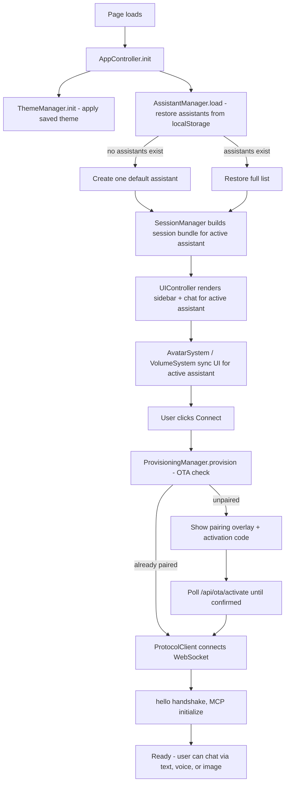
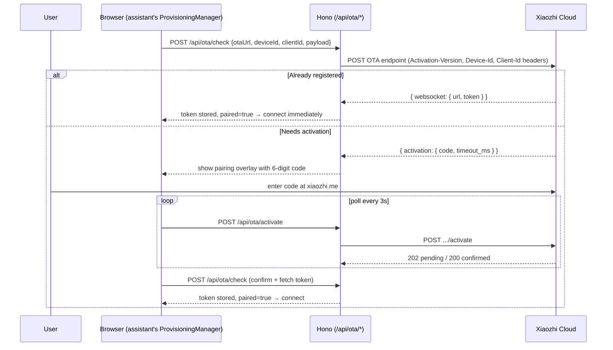
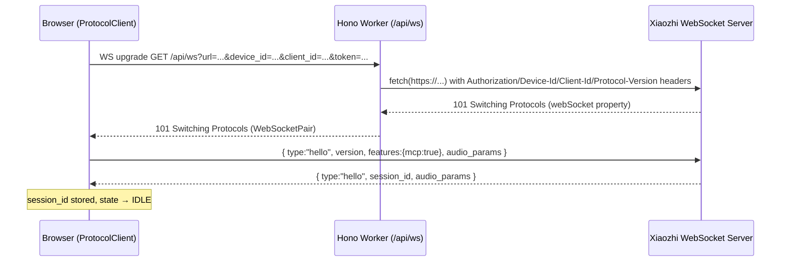
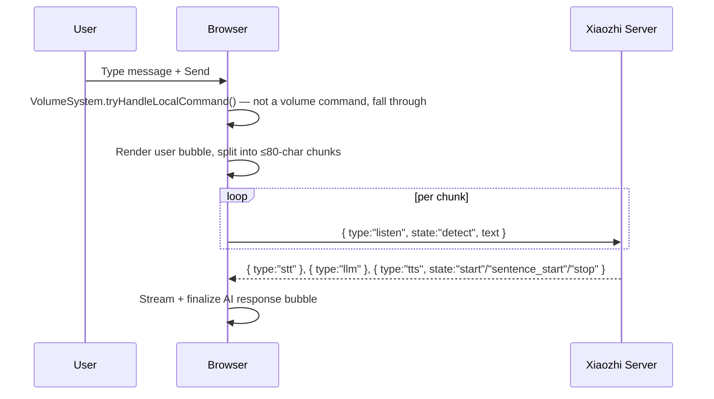
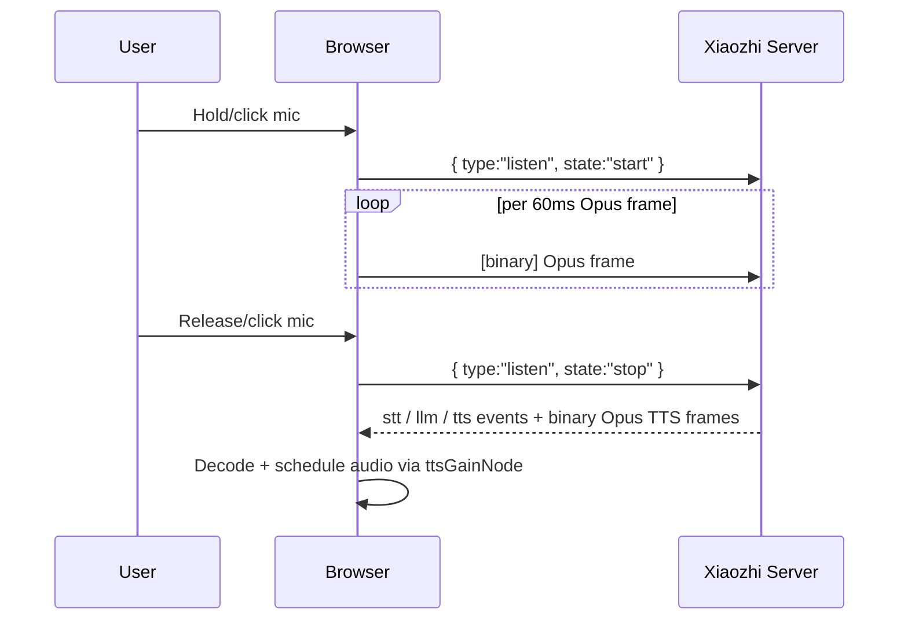
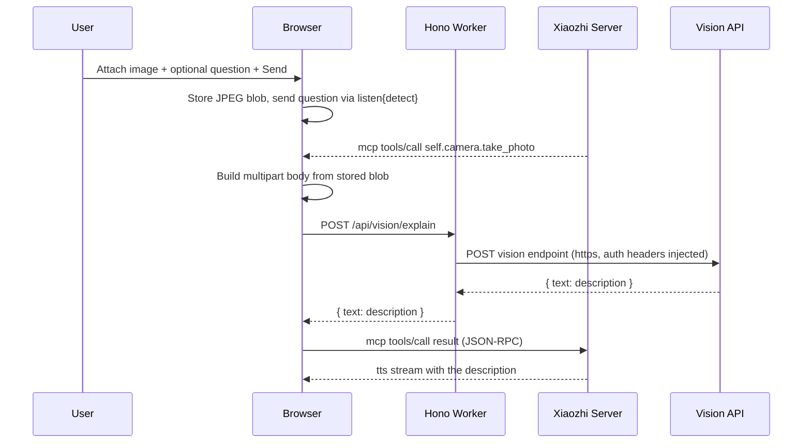

# Olivia — Architecture

This document describes **how Olivia works today**. It is written for a
developer who has just joined the project and needs to understand the
system without reading through years of change history — for that, see
[DEVELOPMENT_HISTORY.md](./DEVELOPMENT_HISTORY.md). For user-facing setup
and usage instructions, see [README.md](./README.md). For a list of
released changes, see [CHANGELOG.md](./CHANGELOG.md).

Only the current implementation is documented here. Historical
implementations, superseded designs, and past decisions are intentionally
omitted.

## Table of Contents

- [System Overview](#system-overview)
- [Overall Architecture](#overall-architecture)
- [Application Flow](#application-flow)
- [AssistantManager](#assistantmanager)
- [Assistant Sessions](#assistant-sessions)
- [Independent Conversations](#independent-conversations)
- [Pairing Workflow](#pairing-workflow)
- [WebSocket Communication](#websocket-communication)
- [Audio Pipeline](#audio-pipeline)
- [Avatar System](#avatar-system)
- [Theme System](#theme-system)
- [Storage](#storage)
- [Cloudflare Architecture](#cloudflare-architecture)
- [Deployment Model](#deployment-model)
- [Project Folder Structure](#project-folder-structure)
- [Key Components](#key-components)
- [Data Flow](#data-flow)

---

## System Overview

Olivia is a two-layer application:

1. **Edge server** (`src/index.tsx`) — a small Hono application deployed to
   Cloudflare Pages/Workers. It serves the static HTML/CSS/JS shell and
   exposes three narrow proxy routes for operations a browser cannot
   perform directly (WebSocket header injection, OTA provisioning, vision
   upload). It has **no knowledge of assistants** — every request, no
   matter which assistant it belongs to, hits the exact same routes.

2. **Browser application** (`public/static/app.js`) — a single vanilla
   JavaScript file organized as self-contained IIFE modules. All Xiaozhi
   ESP32 protocol logic, all multi-assistant orchestration, audio
   processing, vision handling, theming, avatars, and volume control run
   entirely in the browser.

The Xiaozhi cloud is the only external service Olivia talks to. There is
no application database — all state lives in the browser's `localStorage`.

---

## Overall Architecture

```
Browser
  │
  ├── AssistantManager      (localStorage-backed store of every assistant's data)
  ├── SessionManager        (creates/switches/deletes independent per-assistant session bundles)
  │      │
  │      ├── Assistant A session bundle
  │      │     ├── DeviceEmulator        (state machine: IDLE/CONNECTING/LISTENING/SPEAKING/ERROR)
  │      │     ├── ProvisioningManager   (OTA check → activation code → polling → paired)
  │      │     ├── ProtocolClient        (WebSocket to /api/ws proxy → Xiaozhi server)
  │      │     ├── ChatEngine            (text/voice/image send, message history, streaming AI response)
  │      │     └── VisionCapability      (stores vision URL + token from MCP initialize)
  │      │
  │      └── Assistant B, C, … — same independent bundle, running in parallel
  │
  ├── ThemeManager                    (light/dark preference, manual override + persistence)
  ├── AvatarStorage / AvatarSystem    (per-assistant profile picture storage + UI)
  ├── VolumeStorage / VolumeSystem    (per-assistant local playback volume + NL command interception)
  ├── UIController                    (DOM rendering, sidebar, settings panel, event bindings, responsive layout)
  ├── SettingsManager                 (thin backwards-compatible shim over AssistantManager)
  ├── AudioEngine                     (mic capture → libopus-wasm → Opus frames / TTS decode →
  │                                     shared gain node → Web Audio; shared hardware pipeline,
  │                                     routed to whichever assistant is active)
  ├── ImageInput                      (camera viewfinder, gallery picker, pending blob management)
  └── AppController                   (boot sequence, orchestrates all modules, connect/disconnect flow)
       │
       ↓ HTTP / WebSocket (one connection per connected assistant)
Cloudflare Workers (src/index.tsx — Hono)
  │
  ├── GET  /api/ws           → WebSocket proxy (injects Authorization, Device-Id, Client-Id,
  │                            Protocol-Version headers the browser cannot set)
  ├── POST /api/ota/check    → Proxies POST to OTA URL with device headers
  ├── POST /api/ota/activate → Proxies POST to OTA /activate endpoint
  └── POST /api/vision/explain → Proxies multipart/form-data to vision endpoint
                                  (normalises http:// → https://)
       │
       ↓ HTTPS / WSS
Xiaozhi Cloud (api.xiaozhi.me / api.tenclass.net)
  │
  ├── OTA endpoint          (https://api.tenclass.net/xiaozhi/ota/)
  ├── WebSocket endpoint    (wss://api.xiaozhi.me/xiaozhi/v1/)
  ├── Vision endpoint       (https://api.xiaozhi.me/vision/explain)
  └── LLM + TTS             (server-side; streams Opus audio and JSON events to client)
```

Every assistant is, at the protocol layer, its own independent virtual
Xiaozhi ESP32 device (its own `Device-Id`, `Client-Id`, WebSocket
connection, and OTA pairing state). Multi-assistant support is purely an
**orchestration layer** (`AssistantManager` + `SessionManager`) sitting on
top of an otherwise unmodified single-device protocol stack — the Xiaozhi
server always sees clean, isolated device sessions, while the user only
ever sees one app with a roster of named, avatared assistants.

---

## Application Flow



---

## AssistantManager

`AssistantManager` is the single source of truth for every assistant's
persisted data. It is a `localStorage`-backed store, keyed under
`olivia_assistants_v1`, holding one record per assistant:

- Identity: `Device-Id` (MAC-style, lowercase), `Client-Id` (UUID v4)
- Connection settings: WebSocket URL, OTA URL, protocol version, frame
  duration, listening mode
- Pairing state: `paired` flag, access `token`
- Conversation history: full list of chat messages with timestamps
- Display name

`SettingsManager` is a thin, backwards-compatible shim over
`AssistantManager` that exposes the original single-device-style settings
API for any code that still expects it — it does not hold any state of its
own.

`AssistantManager` never stores avatars or speech volume; those live in
their own dedicated storage namespaces (see [Avatar
System](#avatar-system) and the volume section of README's [Per-Assistant
Speech Volume](./README.md#per-assistant-speech-volume)) so that adding a
new per-assistant feature never requires growing this core schema.

---

## Assistant Sessions

`SessionManager` creates, switches, renames, and deletes assistants, and
orchestrates the lifecycle of each assistant's independent **session
bundle**:

| Module | Responsibility |
|---|---|
| `DeviceEmulator` | State machine (`UNKNOWN → STARTING → IDLE → CONNECTING → LISTENING → SPEAKING → ERROR`) — one instance per assistant |
| `ProvisioningManager` | OTA `checkVersion()` / `provision()` / activation polling — one instance per assistant |
| `ProtocolClient` | WebSocket connection, JSON message dispatch, binary framing — one instance per assistant, byte-for-byte the same implementation regardless of assistant count |
| `ChatEngine` | Text/voice/image send, message history, streaming AI response assembly — one instance per assistant |
| `VisionCapability` | Stores the vision URL + token received via MCP `initialize` — one instance per assistant |

Switching the active assistant **never** rebuilds, reconnects, or
disconnects an existing session bundle — it only changes which bundle is
rendered in the main view. A session bundle for a given assistant is
created once (on first connect or on app boot for the active assistant)
and reused for the lifetime of the page.

---

## Independent Conversations

Each assistant's conversation history is stored inside its own
`AssistantManager` record and rendered exclusively by that assistant's own
`ChatEngine` instance. There is no shared message store and no global
"current conversation" — every read and write is scoped by assistant id.
This guarantees:

- Messages, streaming state, and history are never mixed between assistants
- A background assistant's WebSocket can keep receiving `stt`/`llm`/`tts`
  events and keep growing its own history while a different assistant is
  on screen
- Deleting an assistant deletes its conversation history, avatar, and
  volume setting together — nothing is left orphaned

---

## Pairing Workflow

OTA (Over-the-Air) here refers to Xiaozhi's device registration and
credential provisioning flow — not a firmware update. It runs
independently per assistant, through the Hono `/api/ota/check` and
`/api/ota/activate` proxy routes.



Every assistant has its own token, `paired` flag, and activation state.
"Reset Pairing" clears the token for a single assistant only, forcing a
fresh OTA run on next connect for that assistant.

The Xiaozhi server authenticates `Device-Id` case-sensitively and requires
lowercase hex (matching the ESP32 firmware's `%02x` format). Olivia
generates lowercase MAC-style IDs and normalises any legacy uppercase value
found in storage, clearing that assistant's pairing state so it is
re-provisioned with the corrected ID.

---

## WebSocket Communication

The `/api/ws` route on the Hono Worker is a transparent proxy: it accepts
a WebSocket upgrade from the browser, injects the `Authorization`,
`Device-Id`, `Client-Id`, and `Protocol-Version` headers the browser
cannot set on its own, and opens a matching WebSocket to the real Xiaozhi
endpoint, forwarding frames in both directions.



Three Cloudflare Workers runtime specifics that the proxy handles:

1. **`fetch()` must use `https://`, not `wss://`**, for the outbound
   upgrade — the runtime's `webSocket` response property is `null`
   otherwise.
2. **`binaryType = 'arraybuffer'` must be set before `accept()`** on both
   the browser-facing and upstream sockets, so binary Opus frames are
   forwarded as raw `ArrayBuffer` rather than `Blob`.
3. **`allowHalfOpen: true`** on both `accept()` calls, so close frames on
   each side can be coordinated independently during teardown.

Once connected, `ProtocolClient` dispatches the full Xiaozhi JSON message
set (`hello`, `listen`, `stt`, `llm`, `tts`, `abort`, `system`, `alert`,
`mcp`, `custom`) and the binary Opus audio frames, with framing that
depends on the assistant's configured protocol version (v1 raw, v2
16-byte header, v3 4-byte header).

---

## Audio Pipeline

Every assistant runs its own `AudioEngine`-driven pipeline logically, but
the underlying hardware (microphone, speakers) is a single shared resource
routed to whichever assistant is currently active.

**Capture (voice → server):**

```
getUserMedia (16 kHz mono, echo cancellation, noise suppression, AGC)
  → AudioContext @ 16 kHz
  → MediaStreamSource → AnalyserNode (level meter) + ScriptProcessorNode
  → pcmAccumulator → flushAccumulator() slices exact 960-sample (60 ms) frames
  → libopus-wasm Encoder.encodeFloat() → Uint8Array Opus packet
  → ProtocolClient.sendAudio() → binary frame wrapping (v1/v2/v3)
  → WebSocket → /api/ws → Xiaozhi
```

**Playback (server → speakers):**

```
Xiaozhi binary WebSocket frame (Opus @ 24 kHz)
  → ProtocolClient.handleBinaryMessage() strips version header if v2/v3
  → AudioEngine.enqueueTTSChunk() → drainTTSQueue()
  → libopus-wasm Decoder.decodeFloat() (or decodeAudioData() OGG fallback)
  → AudioContext.createBufferSource() → shared ttsGainNode → destination
  → source.start(ttsNextStartTime)   ← pre-scheduled for gapless playback
```

A single shared `GainNode` (`ttsGainNode`) sits between every decoded TTS
frame and the speakers. `AudioEngine.setVolume(0..1)` adjusts this node
directly with a short anti-click ramp; `VolumeSystem` (see below) is the
only caller, and it re-applies the newly-active assistant's saved volume
every time the active assistant changes.

---

## Avatar System

`AvatarStorage` (persistence) and `AvatarSystem` (UI + logic) provide a
per-assistant profile picture, following a storage-layer/logic-layer split
used consistently across Olivia's per-assistant feature modules:

```
AvatarStorage (localStorage layer)
  ├─ save(assistantId, dataUrl)  → localStorage.setItem('olivia_avatar_v1_<id>', dataUrl)
  ├─ load(assistantId)           → localStorage.getItem(...) | null
  └─ remove(assistantId)         → localStorage.removeItem(...)

AvatarSystem (UI layer)
  ├─ openUploadDialog(id)        → opens file picker scoped to one assistant
  ├─ processAndSave(id, File)    → resize/re-encode client-side to 256×256 JPEG (85%) → save
  ├─ refreshAllAvatarDisplays()  → updates chat header + typing indicator images
  └─ loadSettingsAvatar(id)      → updates the settings-panel avatar preview
```

Every image is resized and re-encoded entirely client-side via an
offscreen canvas — nothing is uploaded to a server. Any assistant without a
saved avatar falls back to a bundled default SVG
(`olivia-avatar-default.svg`) with no network dependency. Deleting an
assistant also removes its avatar entry, leaving no orphaned data.

---

## Theme System

`ThemeManager` implements a three-layer cascade:

```
1. [data-theme="dark"]   → manual dark override (highest priority)
2. [data-theme="light"]  → manual light override (highest priority)
3. @media (prefers-color-scheme: dark) { :root:not([data-theme="light"]) }
     → system dark, only when no manual override is set
```

On boot, `ThemeManager.init()` reads any saved preference from
`localStorage` (`olivia_theme_preference`), applies the matching
`data-theme` attribute to `<html>`, and wires the ☀️/🌙 toggle button in
the sidebar header. The icon swap between sun/moon is pure CSS
(`[data-theme]` selectors toggle visibility) — no re-render is triggered by
toggling. The theme preference is global to the app, not per-assistant.

---

## Storage

All data lives in browser `localStorage`. There is no server-side
database — no data leaves the browser except the exact Xiaozhi protocol
traffic (WebSocket, OTA, vision) that a physical ESP32 would also send.

| Key | Contents |
|---|---|
| `olivia_assistants_v1` | Every assistant record: identity, connection settings, protocol settings, pairing/token, conversation history |
| `olivia_theme_preference` | Manual theme override (`'light'` or `'dark'`); absent when following the system preference |
| `olivia_avatar_v1_<assistantId>` | That assistant's custom avatar, as a 256×256 JPEG data URL |
| `olivia_volume_v1_<assistantId>` | That assistant's saved local speech volume, `0`–`1` |

Deleting an assistant removes its avatar and volume keys automatically.
`olivia_assistants_v1` and `olivia_theme_preference` are the only two keys
that persist independently of any single assistant's lifecycle.

---

## Cloudflare Architecture

Olivia's server-side footprint is intentionally minimal — a single Hono
application deployed as a Cloudflare Pages Worker:

- **Static asset serving** — `GET /static/*` via `serveStatic({ root:
  './public' })`, serving `app.js`, `style.css`, logo/branding assets, and
  the manifest.
- **`GET /`** — renders the entire HTML application shell inline (sidebar,
  chat area, settings panel, pairing overlay, info panel, etc.) as a
  single Hono JSX/HTML response.
- **Three proxy routes** — `/api/ws`, `/api/ota/check`,
  `/api/ota/activate`, `/api/vision/explain` — each validates its target
  host against an explicit allow-list before forwarding, and each is
  completely stateless and assistant-agnostic.
- **No Cloudflare storage bindings** (D1/KV/R2) are currently configured —
  all persistence is client-side `localStorage`. `wrangler.jsonc` has
  commented-out placeholders for D1/KV/R2/AI bindings for future use, but
  none are active in the current implementation.

### Allowed Hosts

| Route | Allowed Hosts | Scheme |
|---|---|---|
| `/api/ota/check`, `/api/ota/activate` | `api.tenclass.net`, `xiaozhi.me`, `www.xiaozhi.me`, `api.xiaozhi.me` | `https://` only |
| `/api/ws` | Same as OTA | `wss://` only (rewritten to `https://` internally for the Workers fetch API) |
| `/api/vision/explain` | `api.xiaozhi.me`, `xiaozhi.me`, `www.xiaozhi.me` | Accepts `http://` or `https://`, always upgraded to `https://` before forwarding |

Requests targeting any other host are rejected with HTTP 400.

---

## Deployment Model

Olivia is a **Cloudflare Pages** application with no build-time or
runtime dependency on Node.js APIs, file system access, or a persistent
process:

1. `npm run build` compiles the Hono Worker (`src/index.tsx` →
   `dist/_worker.js`) and copies static assets to `dist/static/`.
2. `wrangler pages deploy dist` uploads the build output to Cloudflare's
   edge network.
3. At request time, the Worker runs on Cloudflare's V8-isolate runtime —
   no environment variables are required for core functionality; the
   Xiaozhi endpoints are configured per-assistant from within the app UI
   and default to the public Xiaozhi cloud.

Because the entire application is stateless at the server layer (all
state is `localStorage`), horizontal scaling and multi-region edge
deployment require no additional coordination — every Worker instance
handles requests identically.

---

## Project Folder Structure

```
olivia/
├── src/
│   ├── index.tsx          # Hono application — all server-side logic
│   │                        (WebSocket proxy, OTA proxy, vision proxy,
│   │                         static file serving, HTML shell)
│   └── renderer.tsx       # Hono JSX renderer configuration
│
├── public/
│   └── static/
│       ├── app.js                    # Complete browser application
│       │                               Multi-assistant orchestration, ESP32 protocol,
│       │                               audio, vision, theming, avatars, volume, UI logic
│       ├── style.css                 # Complete stylesheet — messenger UI, dark mode,
│       │                               responsive layout, animations, avatars, volume popup
│       ├── olivia-avatar-default.svg # Bundled default assistant avatar
│       ├── manifest.json             # PWA web app manifest
│       ├── favicon.svg
│       └── logo/                     # Brand assets (monogram, wordmark, icons)
│
├── docs/
│   └── images/banner.png  # README banner image
│
├── dist/                  # Build output (git-ignored)
│   ├── _worker.js         # Compiled Hono Worker
│   ├── _routes.json       # Cloudflare Pages routing config
│   └── static/
│
├── wrangler.jsonc          # Cloudflare Pages / Workers configuration
├── vite.config.ts          # Vite build configuration (Cloudflare Pages adapter)
├── tsconfig.json           # TypeScript configuration
├── package.json            # Dependencies and scripts
├── ecosystem.config.cjs    # PM2 configuration for local development
├── README.md                # User-facing documentation
├── ARCHITECTURE.md          # This document
├── CHANGELOG.md             # Release history
├── DEVELOPMENT_HISTORY.md   # Engineering history
└── .gitignore
```

---

## Key Components

| Module (in `app.js`) | Responsibility |
|---|---|
| `Logger` | Timestamped debug log with color-coded tags; outputs to `console` and the in-app Debug panel |
| `AssistantManager` | `localStorage`-backed store of every assistant's identity, settings, pairing, and history |
| `SessionManager` | Creates/switches/renames/deletes assistants; orchestrates each assistant's session bundle |
| `SettingsManager` | Backwards-compatible shim over `AssistantManager` |
| `DeviceEmulator` | Per-assistant connection state machine |
| `ProvisioningManager` | Per-assistant OTA provisioning and activation polling |
| `AudioEngine` | Microphone capture, Opus encode/decode, TTS playback scheduling, shared gain node |
| `VisionCapability` | Per-assistant vision URL/token storage from MCP `initialize` |
| `ProtocolClient` | Per-assistant WebSocket connection, JSON dispatch, binary framing |
| `ChatEngine` | Per-assistant text/voice/image send, history, streaming response assembly |
| `ThemeManager` | Global light/dark theme preference and toggle |
| `AvatarStorage` / `AvatarSystem` | Per-assistant avatar persistence and UI |
| `VolumeStorage` / `VolumeSystem` | Per-assistant local speech volume persistence, UI, and natural-language command interception |
| `UIController` | All DOM rendering: sidebar, settings panel, pairing overlay, tabs, responsive layout, toasts |
| `ImageInput` | Camera viewfinder, gallery picker, pending image blob management |
| `AppController` | Application entry point; boot sequence; connect/disconnect orchestration |

---

## Data Flow

### Text message



### Voice message



### Vision (image) message



### Local (non-network) command

```mermaid
sequenceDiagram
    participant U as User
    participant B as Browser

    U->>B: "set your volume to 60%" + Send
    B->>B: VolumeSystem.parseVolumeCommand() matches
    B->>B: VolumeSystem.setVolume() → persist + AudioEngine.setVolume(0.6)
    B->>U: Local confirmation message + toast
    Note over B: Message never reaches ProtocolClient; Xiaozhi is never contacted
```

---

_For how Olivia arrived at this architecture, see
[DEVELOPMENT_HISTORY.md](./DEVELOPMENT_HISTORY.md). For setup and usage,
see [README.md](./README.md)._
