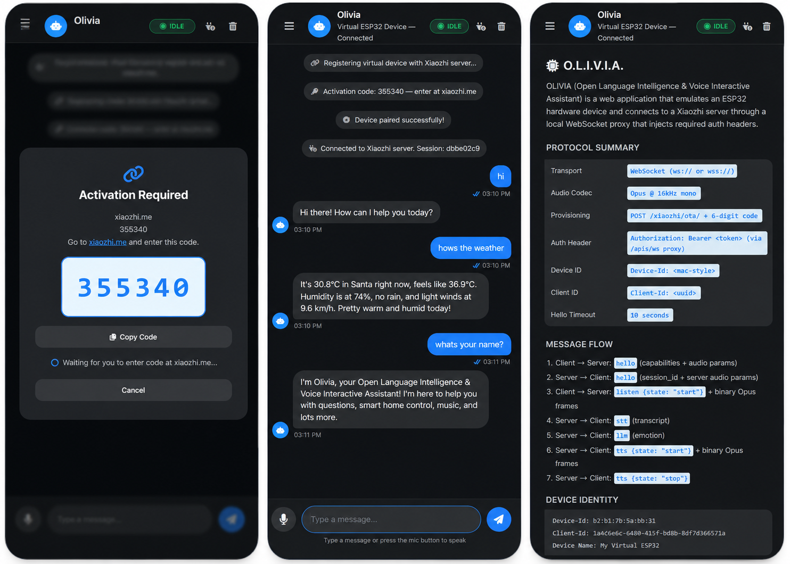
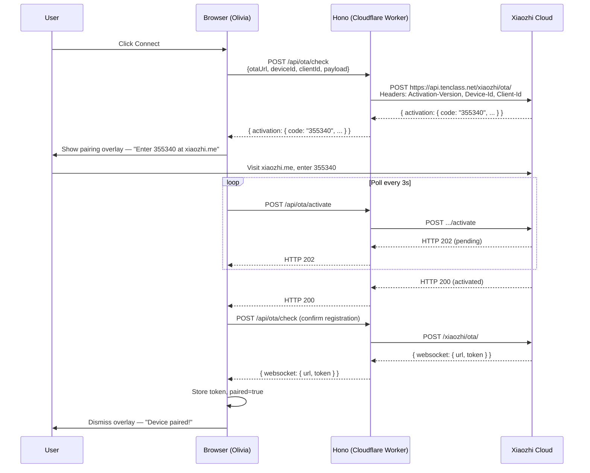
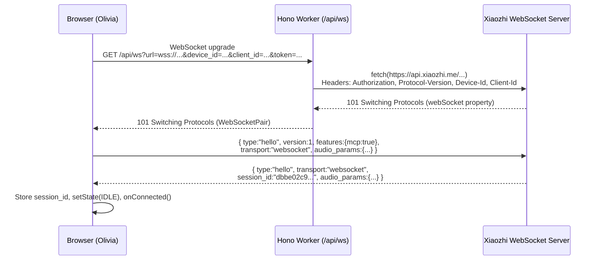
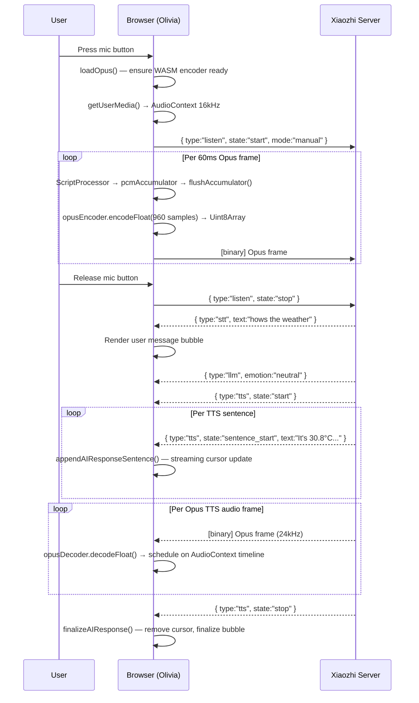
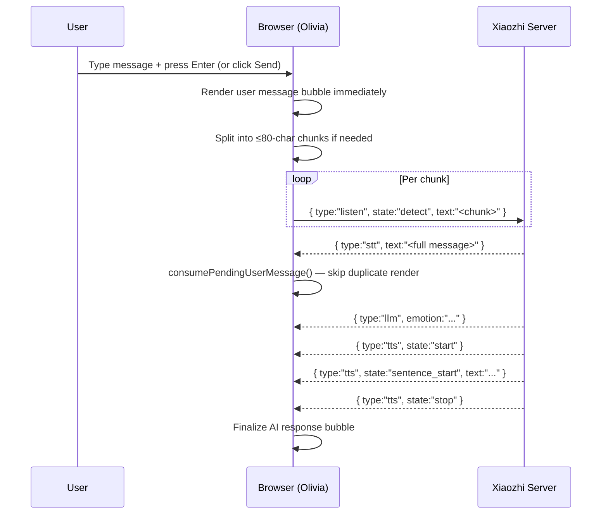
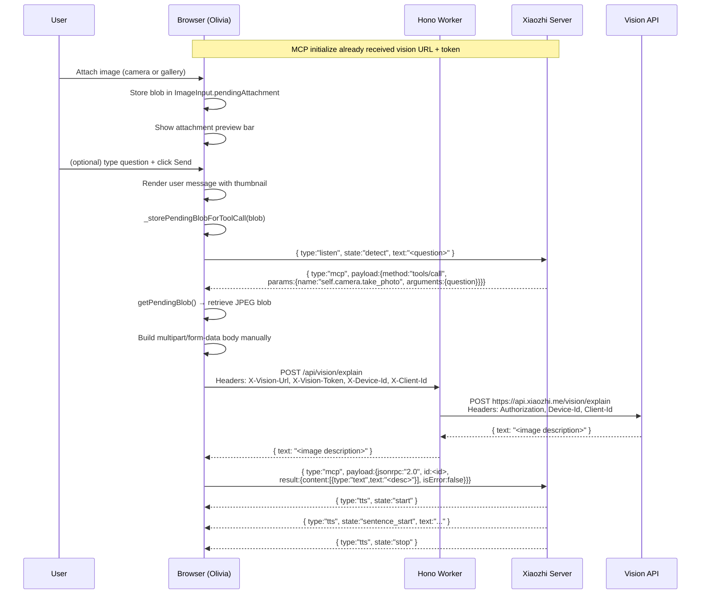
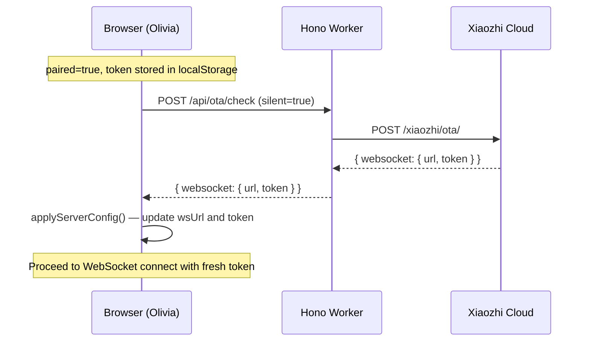

<div align="center">



<br/>
<br/>

# O.L.I.V.I.A.

### Virtual ESP32 Device for Xiaozhi AI

<p align="center">
  
  
  
  
  
  
  
  
  
  
</p>

</div>

---

**Olivia** is a browser-based virtual ESP32 device that faithfully emulates an official Xiaozhi ESP32 hardware device while adding browser-native capabilities such as a live camera viewfinder, photo gallery uploads, and a full messenger-style chat UI. It connects directly to the Xiaozhi cloud using the same OTA provisioning, WebSocket handshake, binary Opus audio protocol, and MCP (Model Context Protocol) tool-call architecture used by real ESP32 firmware — without any physical hardware.

---

## Table of Contents

- [Why Olivia Exists](#why-olivia-exists)
- [Why Olivia? — Browser Advantages](#why-olivia--browser-advantages)
- [Features](#features)
- [Screenshots](#screenshots)
- [Architecture](#architecture)
- [Voice Pipeline](#voice-pipeline)
- [Vision Pipeline](#vision-pipeline)
- [OTA Provisioning and Pairing](#ota-provisioning-and-pairing)
- [MCP — Model Context Protocol](#mcp--model-context-protocol)
- [Installation](#installation)
- [Deployment](#deployment)
- [Project Structure](#project-structure)
- [Configuration](#configuration)
- [Sequence Diagrams](#sequence-diagrams)
- [FAQ](#faq)
- [Roadmap](#roadmap)
- [Contributing](#contributing)
- [License](#license)

---

## Why Olivia Exists

The [Xiaozhi ESP32 project](https://xiaozhi.me) is an open-source AI assistant ecosystem designed to run on physical ESP32 microcontroller hardware. To use Xiaozhi, you normally need a supported ESP32 development board, a microphone, a speaker, and firmware flashed directly onto the chip.

This hardware requirement creates a barrier: you cannot try the Xiaozhi cloud, experiment with its AI capabilities, or develop applications against it without owning and flashing specific hardware.

Olivia exists to close that gap — not by wrapping Xiaozhi in a generic chat interface, but by emulating the entire device identity, provisioning flow, and binary WebSocket protocol that a real ESP32 board speaks. The browser becomes the hardware. The Xiaozhi cloud cannot distinguish Olivia from a real device.

Specifically, Olivia solves the following:

- **Browser WebSockets cannot send custom HTTP headers.** The Xiaozhi server requires `Authorization: Bearer <token>`, `Device-Id`, `Client-Id`, and `Protocol-Version` headers on the WebSocket upgrade request. A browser client cannot set these. Olivia runs a Hono server on Cloudflare Workers that acts as a transparent header-injecting proxy — exactly as the reference Python `proxy.py` client from the `xiaozhi-esp32` repository does.

- **CORS blocks direct vision uploads.** The Xiaozhi vision API (`api.xiaozhi.me/vision/explain`) does not permit cross-origin browser POSTs. Olivia's server-side proxy forwards the multipart image upload with the required auth headers, making the vision pipeline work transparently from any browser.

- **OTA provisioning requires server-side logic.** The ESP32 firmware's `Ota::CheckVersion()` and `Ota::Activate()` calls use device-specific headers (`Activation-Version`, `Device-Id`, `Client-Id`, `User-Agent`, `Accept-Language`) that the browser cannot set on a cross-origin fetch. The Hono backend proxies both OTA calls, injecting the correct headers.

- **Real Opus encoding is required.** The Xiaozhi server rejects raw PCM16 audio with a server-side error. Olivia loads `libopus-wasm` (a WebAssembly build of libopus) to encode microphone PCM at 16 kHz mono into genuine 960-sample Opus frames before sending them over the WebSocket — matching the exact frame duration (`OPUS_FRAME_DURATION_MS = 60`) used by the ESP32 firmware.

---

## Why Olivia? — Browser Advantages

Even after a physical ESP32 is set up, Olivia offers capabilities that hardware cannot:

| Capability | Physical ESP32 | Olivia |
|---|---|---|
| **Camera source** | OV2640 / OV5640 chip | Device camera (front or rear) + photo gallery |
| **Image formats** | Raw JPEG only | JPEG, PNG, WebP, GIF, BMP, HEIC — auto-converted to JPEG |
| **Camera switching** | Hardware wiring | Front/rear toggle in browser |
| **Chat history** | Not available | Full conversation log with timestamps |
| **Protocol debug console** | Serial monitor only | Live debug panel in the browser with timestamped log entries |
| **Device identity** | Burned into firmware | Persistent per-browser, resettable, and manually configurable |
| **Multi-platform** | One physical device | Any desktop, tablet, or phone with a modern browser |
| **Deployment** | Must flash firmware | Deploy to Cloudflare Pages — share a URL |
| **Dark mode** | N/A (no screen) | System-level automatic dark mode via CSS `prefers-color-scheme` |
| **Text mode** | Wake word or button press | Typed messages via the Xiaozhi `listen{detect}` protocol |
| **Pairing reset** | Factory reset firmware | One-click "Reset Pairing" in settings |
| **Protocol version** | Fixed at compile time | Selectable v1 / v2 / v3 at runtime |
| **Frame duration** | Fixed 60 ms | Selectable 20 ms / 40 ms / 60 ms |

---

## Features

### AI & Conversation

- **Full Xiaozhi AI integration** — connects to the official Xiaozhi cloud (`wss://api.xiaozhi.me/xiaozhi/v1/`)
- **Streaming text-to-speech** — AI responses stream sentence-by-sentence with a live typing cursor
- **Emotion support** — the server sends `llm` emotion events (`happy`, `sad`, `angry`, `surprised`, `neutral`, `excited`, `thinking`, `confused`) decoded and available for UI rendering
- **Conversation history** — every exchange is stored in-memory with timestamps and sidebar preview
- **Text message chunking** — long messages are automatically split at sentence boundaries into ≤ 80-character chunks to respect the server's `listen{detect}` wake-word channel limit, then reassembled by the LLM

### Voice

- **Real-time microphone capture** — Web Audio API at 16 kHz mono with echo cancellation, noise suppression, and auto gain control
- **Genuine Opus encoding** — `libopus-wasm` v0.2.0 loaded from jsDelivr CDN encodes raw PCM Float32 into standard 960-sample (60 ms) Opus frames; the server requires real Opus — raw PCM triggers a server error
- **Push-to-talk** — hold the mic button for PTT mode
- **Toggle mode** — click the mic button to start continuous auto-VAD listening; click again to stop
- **Multi-version binary protocol** — sends Opus frames with the correct binary framing for protocol version 1 (raw), version 2 (16-byte timestamped header), or version 3 (4-byte lightweight header)
- **Streaming TTS playback** — incoming Opus frames from the server are decoded by `libopus-wasm` and scheduled on the Web Audio timeline for gapless, low-latency playback at 24 kHz
- **Live audio level meter** — real-time VU bar driven by `AnalyserNode.getByteFrequencyData()` during capture
- **TTS abort** — sending `abort{reason:"user_interruption"}` stops server playback and clears the local audio queue

### Vision

- **Browser camera viewfinder** — live `<video>` stream using `getUserMedia` with front/rear switching; the switch button only appears when multiple cameras are detected
- **Photo capture** — canvas-based JPEG snapshot from the live camera stream at 0.9 quality
- **Retake flow** — preview captured photo before committing; retake if unsatisfied
- **Gallery upload** — file picker accepting JPEG, PNG, WebP, GIF, BMP, HEIC, and any `image/*` type
- **Automatic JPEG conversion** — non-JPEG uploads are converted to JPEG via an offscreen canvas before sending, mirroring the firmware's always-JPEG camera output
- **Attachment preview bar** — thumbnail and filename shown above the text input before sending
- **Vision API proxy** — images are POSTed as raw binary JPEG in `multipart/form-data` to `/api/vision/explain` on the Hono server, which injects auth headers and forwards to the Xiaozhi vision endpoint; the server response URL (`http://`) is normalised to `https://` before forwarding
- **MCP tool-call architecture** — instead of uploading images directly, Olivia stores the pending image blob and sends the user's question via `listen{detect}`, triggering the Xiaozhi LLM to issue a `tools/call` for `self.camera.take_photo`; the blob is retrieved, uploaded, and the JSON-RPC result is returned to the server — exactly as the ESP32 firmware's `mcp_server.cc` does

### Device Emulation

- **Virtual device identity** — auto-generates a persistent MAC-style `Device-Id` (lowercase `xx:xx:xx:xx:xx:xx` format, matching the ESP32 firmware's `%02x` format) and a UUID v4 `Client-Id` on first launch; both are persisted in `localStorage`
- **MAC address case normalisation** — automatically corrects any uppercase MAC addresses saved by older app versions (the Xiaozhi server closes the WebSocket connection immediately on uppercase `Device-Id`)
- **Configurable device name** — sets the `board.name` field in the OTA provisioning payload (default: `My Virtual ESP32`)
- **State machine** — mirrors the ESP32 firmware's `DeviceState` enum: `UNKNOWN → STARTING → IDLE → CONNECTING → LISTENING → SPEAKING → ERROR` with real-time UI updates on each transition
- **Pairing persistence** — `paired` flag and access token stored in `localStorage`; survives page reloads
- **Pairing reset** — clears token and `paired` flag so a fresh OTA provisioning run is triggered on next connect
- **Session ID display** — shows the current session UUID returned in the server's `hello` response

### Protocol

- **Full Xiaozhi WebSocket protocol** — implements the complete message flow including `hello` handshake (device → server), server `hello` ACK, `listen{start/stop/detect}`, `stt`, `llm`, `tts{start/sentence_start/stop}`, `abort`, `system`, `alert`, `mcp`, and `custom`
- **10-second hello timeout** — matches the ESP32 firmware's `WebsocketProtocol::OpenAudioChannel()` timeout
- **Protocol version selection** — v1 (raw Opus), v2 (16-byte header with timestamp), v3 (4-byte lightweight header); binary framing applied on send and stripped on receive
- **Configurable frame duration** — 20 ms, 40 ms, or 60 ms Opus frames
- **Listening mode** — `auto` (server-side VAD triggers stop), `manual` (explicit stop), `realtime`
- **Auth failure detection** — WebSocket close codes 1008, 4001–4003, 4401, 4403 and reason strings matching `auth|token|unauthorized|forbidden` are identified and reported with a clear "Try resetting pairing" message
- **`XiaozhiDebug` global** — every module is exposed on `window.XiaozhiDebug` for browser console debugging: `protocol`, `settings`, `provisioning`, `device`, `audio`, `chat`, `ui`, `app`, `logger`, plus helpers `quickTest(message)`, `sendDetect(text)`, and `opusStatus()`

### Browser UI

- **Messenger-style layout** — left sidebar (device status, navigation tabs, conversation list, audio meter) + main chat area with message bubbles
- **Responsive design** — full-width chat on mobile (≤ 768 px); sidebar becomes a slide-in overlay triggered by a hamburger button
- **Dark mode** — automatic via CSS `prefers-color-scheme: dark`; no manual toggle needed
- **Dynamic viewport height** — uses `100dvh` (dynamic viewport height) so the input area is never obscured by the mobile browser chrome/address bar
- **iOS viewport fix** — `-webkit-fill-available` fallback for browsers without `dvh` support
- **Settings panel** — slides in from the left with all configurable parameters grouped by category
- **Protocol debug console** — switchable tab showing timestamped log entries for BOOT, AUTH, WS, CHAT, PROTO, AUDIO, ERROR, WARN, INFO, STATE, MCP, and VISION events; supports clear and copy-to-clipboard
- **Info panel** — shows the full protocol summary, message flow, and live device identity (Device-Id, Client-Id, device name, pairing status, URLs, protocol version)
- **Activation overlay** — full-screen modal displaying the 6-digit activation code with copy button; polling spinner updates in real time; cancel aborts provisioning
- **Loading overlay** — shown during initialisation with a CSS spinner
- **Toast notifications** — bottom-right notification stack for success, info, warning, and error states; auto-dismiss after 4 seconds
- **Typing indicator** — animated three-dot bubble with a status string (`AI is thinking...`, `Sending to AI...`) shown between send and first TTS sentence
- **Streaming cursor** — blinking `▋` appended to AI response text while the TTS sentence stream is in progress
- **Message image thumbnails** — user messages that include a vision attachment show an inline thumbnail above the text

---

## Screenshots

The banner above shows Olivia in three states. Below are described the key views:

### Activation / Pairing

The activation overlay appears the first time you connect. It displays the 6-digit code returned by the OTA provisioning endpoint and polls automatically. Once you enter the code at [xiaozhi.me](https://xiaozhi.me), the overlay dismisses and the WebSocket connection proceeds.

### Chat

The main view shows a messenger-style chat window. User messages appear in blue bubbles on the right; AI responses stream in grey bubbles on the left with a blinking cursor while audio is playing.

### Voice Mode

While the microphone is active, the left sidebar shows a live audio level meter (VU bar), the device avatar pulses orange, and the state chip in the header reads `LISTENING`. When the AI responds, the avatar pulses purple and the chip reads `SPEAKING`.

### Vision

Attaching an image adds a thumbnail preview bar above the text input. The user can optionally type a question. When sent, the image is held as a pending blob while the question travels to the LLM. The LLM calls `self.camera.take_photo` via MCP, triggering the upload.

### Protocol Debug Console

Switching to the Debug tab in the sidebar shows a live log with colour-coded tags. Each entry includes a millisecond-precise timestamp.

### Info Panel

The Info tab shows the full protocol summary table, message flow list, and live device identity (Device-Id, Client-Id, device name, pairing status, WebSocket URL, OTA URL, protocol version, frame duration).

---

## Architecture

Olivia has two layers:

1. **Hono server** (`src/index.tsx`) — deployed to Cloudflare Pages/Workers. Serves the static HTML/CSS/JS shell and exposes three API routes that act as server-side proxies for operations the browser cannot perform directly.

2. **Browser application** (`public/static/app.js`) — a single vanilla JavaScript file (~4000 lines) organised as self-contained IIFE modules. All ESP32 protocol logic runs in the browser.

```
Browser
  │
  ├── UIController          (DOM rendering, event bindings, responsive layout)
  ├── SettingsManager       (localStorage persistence for all settings)
  ├── DeviceEmulator        (state machine: IDLE/CONNECTING/LISTENING/SPEAKING/ERROR)
  ├── ProvisioningManager   (OTA check → activation code → polling → paired)
  ├── ProtocolClient        (WebSocket to /api/ws proxy → Xiaozhi server)
  ├── AudioEngine           (mic capture → libopus-wasm → Opus frames / TTS decode → Web Audio)
  ├── ChatEngine            (text/voice/image send, message history, streaming AI response)
  ├── ImageInput            (camera viewfinder, gallery picker, pending blob management)
  ├── VisionCapability      (stores vision URL + token from MCP initialize)
  └── AppController         (orchestrates all modules, entry point for user actions)
       │
       ↓ HTTP / WebSocket
Cloudflare Workers (src/index.tsx — Hono)
  │
  ├── GET  /api/ws           → WebSocket proxy (injects Authorization, Device-Id, Client-Id,
  │                            Protocol-Version headers the browser cannot set)
  ├── POST /api/ota/check    → Proxies POST to OTA URL with device headers
  ├── POST /api/ota/activate → Proxies POST to OTA /activate endpoint
  └── POST /api/vision/explain → Proxies multipart/form-data to vision endpoint
                                  (normalises http:// → https://)
       │
       ↓ HTTPS / WSS
Xiaozhi Cloud (api.xiaozhi.me / api.tenclass.net)
  │
  ├── OTA endpoint          (https://api.tenclass.net/xiaozhi/ota/)
  ├── WebSocket endpoint    (wss://api.xiaozhi.me/xiaozhi/v1/)
  ├── Vision endpoint       (https://api.xiaozhi.me/vision/explain)
  └── LLM + TTS             (server-side; streams Opus audio and JSON events to client)
```

### Cloudflare Workers WebSocket Proxy — Critical Notes

The proxy at `/api/ws` has three non-obvious requirements specific to the Cloudflare Workers runtime:

1. **`fetch()` for WebSocket upgrade must use `https://`, not `wss://`.** Passing `wss://` to `fetch()` causes the `webSocket` property on the response to be `null`. The proxy rewrites `wss://` → `https://` before calling `fetch()`.

2. **`binaryType` must be set to `'arraybuffer'` before `accept()`.** On Cloudflare compatibility dates ≥ 2026-03-17, binary frames default to `Blob`. The proxy sets `upstream.binaryType = 'arraybuffer'` before `upstream.accept()` to ensure Opus audio frames are forwarded as raw `ArrayBuffer`.

3. **`allowHalfOpen: true` on both `accept()` calls.** Required so close frames on each side can be coordinated independently during proxy teardown.

---

## Voice Pipeline

Voice input flows through the following stages:

```
User microphone
      │
      ▼
navigator.mediaDevices.getUserMedia()
  { channelCount: 1, sampleRate: 16000,
    echoCancellation: true, noiseSuppression: true, autoGainControl: true }
      │
      ▼
AudioContext @ 16 kHz (separate from TTS playback context @ 24 kHz)
      │
      ▼
MediaStreamSource → AnalyserNode (level meter) + ScriptProcessorNode (4096-sample buffer)
      │
      ▼  onaudioprocess — appends Float32 samples to pcmAccumulator
      │
      ▼  flushAccumulator() — slices into exact 960-sample frames (60 ms @ 16 kHz)
      │                        uses flushInProgress guard to prevent race conditions
      ▼
libopus-wasm Encoder
  { sampleRate: 16000, channels: 1, application: Voip, frameSize: 960, bitrate: 24000 }
      │
      ▼  encodeFloat() → Uint8Array (raw Opus packet)
      │
      ▼
ProtocolClient.sendAudio(opusBuffer)
      │
      ▼  Binary frame wrapping (protocol version 1/2/3)
      │
      ▼
WebSocket → /api/ws proxy → Xiaozhi WebSocket server
```

TTS playback reverses the flow:

```
Xiaozhi server
      │  binary WebSocket frame (Opus @ 24 kHz)
      ▼
ProtocolClient.handleBinaryMessage() — strips version header if v2/v3
      │
      ▼
AudioEngine.enqueueTTSChunk()
      │
      ▼
drainTTSQueue() — runs asynchronously
      │
      ├── Path 1: libopus-wasm Decoder.decodeFloat() → Float32Array
      │   (24 kHz mono)
      │
      └── Path 2: Web Audio decodeAudioData() fallback (OGG/Opus container)
      │
      ▼
AudioContext.createBuffer() + createBufferSource()
  source.start(ttsNextStartTime)   ← pre-scheduled for gapless playback
  ttsNextStartTime += frameDurationS
```

The pre-scheduling clock (`ttsNextStartTime`) is the key to gapless TTS: each Opus frame is scheduled at exactly the end of the previous frame's duration, rather than waiting for an `onended` callback (which introduces an audible gap between every frame).

---

## Vision Pipeline

The vision pipeline mirrors `Esp32Camera::Explain()` from the official ESP32 firmware (`xiaozhi-esp32/main/boards/common/esp32_camera.cc`):

```
User selects image
  │
  ├── Camera path:
  │     getUserMedia (video) → <video> live feed → canvas.drawImage() → canvas.toDataURL()
  │     → Blob (JPEG @ 0.9 quality) → setAttachment(blob, name, dataUrl)
  │
  └── Gallery path:
        <input type="file"> → FileReader.readAsDataURL() → setAttachment(blob, name, dataUrl)
        Non-JPEG → convertToJpeg() via offscreen canvas → Blob (JPEG @ 0.85 quality)
      │
      ▼
ImageInput.pendingAttachment.blob  (held in memory)
      │
      ▼
User types optional question + clicks Send
      │
      ▼
ChatEngine.sendImageMessage(blob, question, name, dataUrl)
      │
      ├── Renders user message bubble with thumbnail
      ├── Stores blob in ImageInput._storePendingBlobForToolCall()
      ├── Sends question via ProtocolClient.sendListenDetect(question.slice(0, 80))
      │     → Server's LLM determines vision is needed
      │     → Server sends MCP tools/call: self.camera.take_photo
      │
      ▼
ProtocolClient.handleMCP() — tools/call branch
      │
      ├── ImageInput.getPendingBlob() → retrieves the stored JPEG blob
      ├── Builds multipart/form-data body manually:
      │     --boundary
      │     Content-Disposition: form-data; name="question"
      │     <question text>
      │     --boundary
      │     Content-Disposition: form-data; name="file"; filename="camera.jpg"
      │     Content-Type: image/jpeg
      │     <raw JPEG bytes>
      │     --boundary--
      │
      ▼
POST /api/vision/explain (Hono proxy)
  Headers: X-Vision-Url, X-Vision-Token, X-Device-Id, X-Client-Id, Content-Type
      │
      ▼
Hono validates host → normalises http:// → https:// → forwards to api.xiaozhi.me
      │
      ▼
Xiaozhi Vision API → AI image description → plain text or JSON { "text": "..." }
      │
      ▼
MCP JSON-RPC result sent back over WebSocket:
  { type:"mcp", payload:{ jsonrpc:"2.0", id:<tool_id>,
      result:{ content:[{type:"text", text:"<description>"}], isError:false }}}
      │
      ▼
Server feeds tool result to LLM → TTS sentence stream → Browser audio playback
```

**Key distinction between camera and gallery uploads:** The image source (live camera capture vs. file picker) is normalised before storage — both produce a `Blob` with type `image/jpeg` (or are converted to one). From the perspective of the MCP tool handler and the vision proxy, there is no difference between a camera photo and a gallery image.

---

## OTA Provisioning and Pairing

OTA (Over-the-Air) in the Xiaozhi ecosystem refers to the initial device registration and credential provisioning flow, not a firmware update. It mirrors the `Ota::CheckVersion()` and `Ota::Activate()` functions in the official `xiaozhi-esp32` firmware.

### Flow

```
1. Browser → /api/ota/check (POST)
   Body: { otaUrl, deviceId, clientId, payload: { device info JSON } }
   Hono adds: Activation-Version, Device-Id, Client-Id, User-Agent, Accept-Language headers
   Forwards to: https://api.tenclass.net/xiaozhi/ota/
   │
   ├── Response A: no activation block, has token → device is registered
   │     SettingsManager.set('paired', true)
   │     SettingsManager.set('token', token)
   │     → connect WebSocket immediately
   │
   └── Response B: activation block present
         { activation: { code: "355340", message: "...", timeout_ms: 300000 } }
         → show pairing overlay with the 6-digit code

2. Browser polls /api/ota/activate every 3 seconds (up to 100 attempts ≈ 5 min)
   User visits xiaozhi.me and enters the code
   │
   ├── HTTP 202 → still pending → keep polling
   │
   └── HTTP 200 → activation confirmed
         → call /api/ota/check again to confirm registration and fetch final token
         → if check returns no activation block: SettingsManager.set('paired', true)
         → dismiss pairing overlay → open WebSocket connection

3. On subsequent connects: silent OTA refresh (provision(silent=true))
   Fetches latest token and WebSocket URL; handles re-pairing if server reset device
```

### Device Identity Payload

When POSTing to the OTA endpoint, Olivia sends a JSON body that mirrors the ESP32 `CheckVersion()` payload:

```json
{
  "version": 2,
  "language": "en-US",
  "flash_size": 0,
  "minimum_free_heap_size": 0,
  "mac_address": "<device_id>",
  "uuid": "<client_id>",
  "chip_model_name": "web-client",
  "application": {
    "name": "xiaozhi-web-client",
    "version": "1.0.0",
    "compile_time": "<ISO timestamp>",
    "idf_version": "5.0",
    "elf_sha256": ""
  },
  "board": {
    "type": "web-client",
    "name": "My Virtual ESP32",
    "ip": "127.0.0.1",
    "mac": "<device_id>"
  }
}
```

### MAC Address Format

The Xiaozhi server authenticates `Device-Id` case-sensitively. The ESP32 firmware generates the MAC address using `%02x` (lowercase). Olivia enforces lowercase at generation time and also normalises any stored uppercase MAC on load, clearing the pairing state so the corrected ID is re-provisioned.

---

## MCP — Model Context Protocol

MCP is the JSON-RPC 2.0 based capability negotiation and tool-call protocol used between the Xiaozhi server and connected devices. It allows the server's LLM to call device-side "tools" — such as the camera — and receive structured results.

All MCP messages are transported as JSON text frames over the existing Xiaozhi WebSocket connection, wrapped in `{ type: "mcp", session_id: "...", payload: { ...json-rpc... } }`.

### Initialize Handshake

When the WebSocket connection is established, the server sends an `initialize` request:

```json
{
  "type": "mcp",
  "payload": {
    "jsonrpc": "2.0",
    "id": 1,
    "method": "initialize",
    "params": {
      "capabilities": {
        "vision": {
          "url": "http://api.xiaozhi.me/vision/explain",
          "token": "<vision_token>"
        }
      }
    }
  }
}
```

Olivia extracts `capabilities.vision.url` and `capabilities.vision.token` into the `VisionCapability` singleton (mirroring `Esp32Camera::ParseCapabilities()` in `mcp_server.cc`), then responds:

```json
{
  "type": "mcp",
  "session_id": "<session_id>",
  "payload": {
    "jsonrpc": "2.0",
    "id": 1,
    "result": {
      "protocolVersion": "2024-11-05",
      "capabilities": { "tools": {} },
      "serverInfo": { "name": "xiaozhi-web-client", "version": "1.0.0" }
    }
  }
}
```

**Note:** The server sends the vision URL as `http://` even though the actual endpoint requires `https://`. This is a known quirk of the Xiaozhi server. Olivia's `/api/vision/explain` proxy normalises the URL to `https://` before forwarding.

### tools/list

The server queries available device tools:

```json
{ "method": "tools/list", "id": 2 }
```

Olivia responds with the `self.camera.take_photo` tool if and only if a vision capability URL was received during `initialize`:

```json
{
  "result": {
    "tools": [{
      "name": "self.camera.take_photo",
      "description": "Always remember you have a camera. If the user asks you to see something, use this tool to take a photo and then explain it.\nArgs:\n  `question`: The question that you want to ask about the photo.\nReturn:\n  A JSON object that provides the photo information.",
      "inputSchema": {
        "type": "object",
        "properties": { "question": { "type": "string" } },
        "required": ["question"]
      }
    }]
  }
}
```

This mirrors `McpServer::AddCommonTools()` in `mcp_server.cc` lines 100–121.

### tools/call — self.camera.take_photo

When the LLM determines the user wants vision analysis, the server calls:

```json
{
  "method": "tools/call",
  "params": {
    "name": "self.camera.take_photo",
    "arguments": { "question": "What is in this image?" }
  }
}
```

Olivia:
1. Retrieves the pending image `Blob` from `ImageInput.getPendingBlob()`
2. Converts to JPEG if needed
3. Manually builds a `multipart/form-data` body (no `FormData` API — the boundary and binary construction are done by hand to mirror the firmware's `http->PostBody()` call)
4. POSTs to `/api/vision/explain` (Hono proxy)
5. Parses the response — tries JSON `.text` field first, falls back to plain text
6. Returns the JSON-RPC result, wrapping the description exactly as `McpTool::Call()` does in `mcp_server.h` lines 285–305:

```json
{
  "result": {
    "content": [{ "type": "text", "text": "<AI description of the image>" }],
    "isError": false
  }
}
```

---

## Installation

### Requirements

- **Node.js** 18 or later
- **npm** 9 or later
- A Xiaozhi account at [xiaozhi.me](https://xiaozhi.me) (free) — required for device pairing
- (For Cloudflare deployment) A Cloudflare account with Wrangler authenticated

### Clone and Install

```bash
git clone https://github.com/your-username/olivia.git
cd olivia
npm install
```

### Local Development

Build the project first (required — Wrangler pages dev serves the compiled `dist/` directory):

```bash
npm run build
```

Then start the local development server:

```bash
npm run preview
# or with PM2:
pm2 start ecosystem.config.cjs
```

The application is available at `http://localhost:3000`.

### Build for Production

```bash
npm run build
```

Output is written to `dist/`. The Hono Worker is compiled to `dist/_worker.js`. Static assets go to `dist/static/`.

### Generate Cloudflare Type Bindings

If you add Cloudflare services (D1, KV, R2, AI) to `wrangler.jsonc`, regenerate TypeScript types:

```bash
npm run cf-typegen
```

Then use the generated `CloudflareBindings` interface in `src/index.tsx`:

```typescript
const app = new Hono<{ Bindings: CloudflareBindings }>()
```

### NPM Scripts Reference

| Script | Description |
|---|---|
| `npm run dev` | Start Vite development server (frontend only, no Worker) |
| `npm run build` | Compile TypeScript + bundle for Cloudflare Pages (`dist/`) |
| `npm run preview` | Run the built app locally with `wrangler pages dev` |
| `npm run deploy` | Build then deploy to Cloudflare Pages |
| `npm run cf-typegen` | Generate TypeScript bindings from `wrangler.jsonc` |

---

## Deployment

### Local (Wrangler Pages Dev)

```bash
npm run build
npx wrangler pages dev dist --ip 0.0.0.0 --port 3000
```

### Cloudflare Pages — First Deploy

1. Authenticate Wrangler:
   ```bash
   npx wrangler login
   ```

2. Deploy:
   ```bash
   npm run deploy
   ```

   On first run, Wrangler creates a new Cloudflare Pages project. Note the project name.

3. Subsequent deploys:
   ```bash
   npm run deploy
   ```

### Environment Variables

Olivia does not require any environment variables for its core function. The OTA and WebSocket URLs are user-configurable in the browser settings UI and default to the official Xiaozhi endpoints.

If you deploy a self-hosted Xiaozhi server and want different defaults, edit the `DEFAULTS` object in `public/static/app.js`:

```js
const DEFAULTS = {
  wsUrl:  'wss://api.xiaozhi.me/xiaozhi/v1/',
  otaUrl: 'https://api.tenclass.net/xiaozhi/ota/',
  // ...
}
```

### Allowed Hosts (Security)

The Hono server enforces host allowlists for all three proxied routes:

| Route | Allowed Hosts |
|---|---|
| `/api/ota/check`, `/api/ota/activate` | `api.tenclass.net`, `xiaozhi.me`, `www.xiaozhi.me`, `api.xiaozhi.me` |
| `/api/ws` | Same as OTA, `wss://` only |
| `/api/vision/explain` | `api.xiaozhi.me`, `xiaozhi.me`, `www.xiaozhi.me` (accepts both `http://` and `https://`) |

Requests to any other host are rejected with HTTP 400.

### Custom Domain

Set a custom domain through the Cloudflare Pages dashboard or via:

```bash
npx wrangler pages domain add your-domain.com --project-name <project>
```

---

## Project Structure

```
olivia/
├── src/
│   ├── index.tsx          # Hono application — all server-side logic
│   │                        (WebSocket proxy, OTA proxy, vision proxy,
│   │                         static file serving, HTML shell)
│   └── renderer.tsx       # Hono JSX renderer configuration
│
├── public/
│   └── static/
│       ├── app.js         # Complete browser application (~4000 lines)
│       │                    All ESP32 protocol, audio, vision, and UI logic
│       └── style.css      # Complete stylesheet — messenger UI, dark mode,
│                            responsive layout, animations
│
├── dist/                  # Build output (git-ignored)
│   ├── _worker.js         # Compiled Hono Worker
│   ├── _routes.json       # Cloudflare Pages routing config
│   └── static/
│       ├── app.js
│       └── style.css
│
├── wrangler.jsonc          # Cloudflare Pages / Workers configuration
├── vite.config.ts          # Vite build configuration (Cloudflare Pages adapter)
├── tsconfig.json           # TypeScript configuration
├── package.json            # Dependencies and scripts
├── ecosystem.config.cjs    # PM2 configuration for local development
├── .gitignore
└── README.md
```

### Source File Details

#### `src/index.tsx`

The Hono application. Contains:

- **`ALLOWED_OTA_HOSTS`** — set of permitted hostnames for OTA proxy calls
- **`ALLOWED_VISION_HOSTS`** — set of permitted hostnames for vision proxy calls
- **`isAllowedVisionUrl()`** — accepts both `http://` and `https://` for vision URLs (the server sends `http://`)
- **`normaliseVisionUrl()`** — upgrades `http://` to `https://` before forwarding
- **`isAllowedOtaUrl()`** — requires `https://` for OTA
- **`isAllowedWsUrl()`** — requires `wss://` scheme
- **`buildOtaHeaders()`** — constructs the device-identity headers for OTA requests
- **`formatBearerToken()`** — normalises token to `Bearer <token>` format, matching the firmware's bearer prefix logic
- **`GET /api/ws`** — full WebSocket proxy with pending message queue, Blob→ArrayBuffer conversion, `allowHalfOpen` coordination, and `binaryType = 'arraybuffer'` fix
- **`POST /api/ota/check`** — proxies OTA version check
- **`POST /api/ota/activate`** — proxies OTA activation polling
- **`POST /api/vision/explain`** — proxies vision multipart upload
- **`GET /static/*`** — serves static assets via `serveStatic`
- **`GET /favicon.svg`** — inline SVG favicon
- **`GET /`** — serves the complete HTML application shell

#### `public/static/app.js`

The browser application. Organised as IIFE modules:

| Module | Responsibility |
|---|---|
| `Logger` | Timestamped debug log with colour-coded tags; outputs to both `console` and the Debug panel |
| `SettingsManager` | `localStorage`-backed settings store with auto-generation of Device-Id and Client-Id |
| `DeviceEmulator` | State machine (`UNKNOWN/STARTING/IDLE/CONNECTING/LISTENING/SPEAKING/ERROR`) with listener dispatch |
| `ProvisioningManager` | Full OTA provisioning: `checkVersion()`, `provision()`, `waitForActivation()`, polling loop |
| `AudioEngine` | Microphone capture, PCM accumulator, Opus encoding via libopus-wasm, TTS decoding, pre-scheduled Web Audio playback |
| `VisionCapability` | Stores the vision URL and token received from MCP `initialize` |
| `ProtocolClient` | WebSocket connection, full JSON message dispatch, binary protocol framing (v1/v2/v3), all send/listen/abort helpers |
| `ChatEngine` | Text and voice send, image send, message history, streaming AI response assembly |
| `UIController` | All DOM rendering, settings panel, pairing overlay, tab switching, responsive sidebar, toast notifications |
| `ImageInput` | Plus menu, camera viewfinder (front/rear switching), photo capture, gallery file picker, attachment preview, pending blob management |
| `AppController` | Application entry point, orchestrates all modules, connect/disconnect flow |

#### `public/static/style.css`

Full application stylesheet. Key sections:

- CSS custom properties with light/dark mode variants via `@media (prefers-color-scheme: dark)`
- App layout (sidebar + chat area flex layout)
- Message bubbles (outgoing blue, incoming grey, grouped, streaming with cursor)
- Sidebar components (device avatar with animated pulses per state, tabs, conversation list, audio meter)
- Settings panel (slide-in animation, form groups)
- Camera modal (viewfinder, capture controls, preview)
- Attachment bar, toast container, pairing overlay, loading overlay
- Responsive breakpoints (`@media (max-width: 768px)`)

---

## Configuration

All user-facing configuration is available through the Settings panel (gear icon in the sidebar header). Settings are persisted in `localStorage` under the key `xiaozhi_web_client_settings`.

### Connection

| Setting | Default | Description |
|---|---|---|
| **WebSocket URL** | `wss://api.xiaozhi.me/xiaozhi/v1/` | WebSocket endpoint for the Xiaozhi server. Updated automatically by the OTA provisioning response. |
| **OTA / Provisioning URL** | `https://api.tenclass.net/xiaozhi/ota/` | Device registration endpoint. Must be on the allowed host list. |

### Virtual Device Identity

| Setting | Default | Description |
|---|---|---|
| **Device Name** | `My Virtual ESP32` | Sent in the OTA `board.name` field. |
| **Device-Id** | Auto-generated | MAC-style address (`xx:xx:xx:xx:xx:xx`, lowercase). Persisted across sessions. Leave blank to auto-generate. Manually entered values are normalised to lowercase. |
| **Client-Id** | Auto-generated | UUID v4. Persisted across sessions. Leave blank to auto-generate. |

### Protocol Settings

| Setting | Default | Options | Description |
|---|---|---|---|
| **Protocol Version** | `1` | 1, 2, 3 | Binary audio frame format: v1 = raw Opus; v2 = 16-byte header with timestamp; v3 = 4-byte lightweight header |
| **Frame Duration** | `60 ms` | 20 ms, 40 ms, 60 ms | Opus encoding frame size. 60 ms is the firmware default and produces 960 samples at 16 kHz. |
| **Listening Mode** | `auto` | auto, manual, realtime | How `listen{start}` is sent: `auto` = server-side VAD stops the stream; `manual` = explicit stop required; `realtime` = continuous |

### Audio

| Setting | Default | Description |
|---|---|---|
| **Enable Microphone** | On | When disabled, the mic button has no effect and voice mode is unavailable |
| **Play TTS audio** | On | When disabled, incoming Opus audio frames from the server are not decoded or played |

### Internal (Not User-Editable in UI)

| Key | Description |
|---|---|
| `token` | Access token returned by OTA provisioning. Populated automatically. Not shown in UI. |
| `paired` | Boolean. Set to `true` after successful OTA activation. Cleared by "Reset Pairing". |

---

## Sequence Diagrams

### First Connection (Unpaired Device)



### WebSocket Connection and Hello Handshake



### Voice Conversation



### Text Message



### Vision (Image) Conversation



### OTA Activation (Already Paired Device — Silent Refresh)



---

## FAQ

**What is Olivia?**

Olivia is a browser application that emulates an official Xiaozhi ESP32 hardware device. It speaks the same OTA provisioning protocol, the same WebSocket message protocol, and the same binary Opus audio format as a physical ESP32 board with Xiaozhi firmware. From the Xiaozhi server's perspective, Olivia is indistinguishable from a real device.

**Is it ChatGPT or a generic AI assistant?**

No. Olivia does not talk to OpenAI or any other AI provider directly. It connects exclusively to the Xiaozhi AI cloud (`api.xiaozhi.me`). The AI model, voice, and capabilities are entirely determined by the Xiaozhi server configuration.

**Does it require an ESP32?**

No. Olivia runs entirely in a browser. No hardware is needed.

**Does it connect directly to the Xiaozhi server?**

Mostly. All AI conversation goes through Olivia's Hono proxy (`/api/ws`) which forwards WebSocket frames transparently — the proxy's only function is to inject HTTP headers that browser WebSockets cannot set. The OTA and vision calls are similarly proxied for the same reason. There is no middleware that reads, modifies, or stores conversation content.

**Why does it need a proxy at all?**

The browser's WebSocket API does not allow setting custom HTTP headers on the upgrade request. The Xiaozhi server requires `Authorization: Bearer <token>`, `Device-Id`, `Client-Id`, and `Protocol-Version` headers. Without these, the server closes the connection immediately. The Hono server adds these headers server-side.

**Can I deploy it myself?**

Yes. Deploy to Cloudflare Pages with `npm run deploy`. No environment variables are required. The only external dependency is a Xiaozhi account for device pairing.

**Can it replace a physical ESP32?**

For AI conversation, text mode, and vision — yes, fully. For GPIO control, sensor reading, physical buttons, LEDs, or embedded integrations — no. Olivia is a software emulation, not a hardware replacement.

**What happens if I close the browser tab?**

The `beforeunload` handler sends a clean WebSocket disconnect. Your device identity (`Device-Id`, `Client-Id`, and pairing state) persists in `localStorage` and is restored on next load.

**Does it work on mobile?**

Yes. The layout is fully responsive. On screens ≤ 768 px, the sidebar becomes a slide-in overlay. The mic button supports both touch (push-to-talk) and tap (toggle). The camera modal works with mobile front and rear cameras.

**What is `test-token`?**

The Xiaozhi OTA endpoint returns `"token": "test-token"` as the access token for registered devices on the public cloud. This is the legitimate bearer token for the Xiaozhi cloud — the server authenticates primarily via `Device-Id` and `Client-Id`, not the token value itself. Olivia uses whatever token the OTA endpoint returns.

**Why must Device-Id be lowercase?**

The ESP32 firmware generates the MAC address using `sprintf(buf, "%02x:%02x:...", ...)` — lowercase hex. The Xiaozhi server stores and validates `Device-Id` case-sensitively and closes the WebSocket immediately when it receives an uppercase address. Olivia enforces lowercase at generation time and normalises any stored uppercase addresses.

**The vision upload says "Vision URL host is not allowed".**

This occurred in older versions when the server's `http://` vision URL was rejected by the proxy. It is fixed: the proxy now accepts both `http://` and `https://` vision URLs from `api.xiaozhi.me` and normalises them to `https://` before forwarding.

---

## Roadmap

```
Core Protocol
  [x] WebSocket proxy (header injection)
  [x] OTA provisioning (check + activate + polling)
  [x] Hello handshake (device → server, server ACK)
  [x] Binary Opus audio upload (v1 / v2 / v3 framing)
  [x] Binary Opus TTS playback (pre-scheduled gapless)
  [x] Text mode via listen{detect}
  [x] Long message chunking
  [x] STT, LLM, TTS event handling
  [x] Abort
  [x] System command (reboot)
  [x] Alert
  [x] MCP initialize + tools/list + tools/call
  [ ] MCP resources/list + resources/read
  [ ] MCP prompts/list + prompts/get
  [ ] MCP notifications (server → client tool updates)

Voice
  [x] Microphone capture at 16 kHz
  [x] Real Opus encoding via libopus-wasm
  [x] Push-to-talk mode
  [x] Toggle (auto) mode
  [x] Audio level meter
  [x] TTS playback via libopus-wasm + Web Audio
  [x] TTS playback fallback via decodeAudioData
  [ ] AudioWorklet-based capture (replace ScriptProcessor — deprecated API)
  [ ] VAD (voice activity detection) to auto-stop listening
  [ ] Speaker volume control

Vision
  [x] Browser camera (front/rear)
  [x] Photo capture and preview
  [x] Gallery file upload
  [x] Automatic JPEG conversion
  [x] Vision proxy (multipart forwarding)
  [x] MCP tool-call architecture for take_photo
  [ ] Multiple image attachment per message
  [ ] Document attachment (PDF, text files)

UI
  [x] Messenger-style chat layout
  [x] Dark mode (automatic)
  [x] Responsive / mobile layout
  [x] Protocol debug console
  [x] Info panel
  [x] Settings panel
  [x] Pairing overlay
  [x] Toast notifications
  [x] Streaming AI response with cursor
  [x] Image thumbnails in chat bubbles
  [ ] Conversation history persistence (localStorage or IndexedDB)
  [ ] Conversation export (JSON / Markdown)
  [ ] Multiple conversation sessions
  [ ] Emoji / reaction support

Deployment
  [x] Cloudflare Pages deployment
  [x] PM2 configuration for local
  [ ] Docker compose for self-hosted backend proxy
  [ ] PWA manifest + service worker for installable app
```

---

## Contributing

Contributions are welcome. Please follow these guidelines.

### Getting Started

```bash
git clone https://github.com/your-username/olivia.git
cd olivia
npm install
npm run build
npm run preview
```

Open `http://localhost:3000`. Use the Protocol Debug console (Debug tab in the sidebar) to inspect all message traffic.

Use `window.XiaozhiDebug` in the browser console to access all modules directly:

```js
// Connect and send a test message
await XiaozhiDebug.quickTest("Hello Xiaozhi!")

// Check Opus WASM status
await XiaozhiDebug.opusStatus()

// Send a raw detect message
XiaozhiDebug.sendDetect("what time is it?")

// Inspect current settings
XiaozhiDebug.settings.getAll()

// Check device state
XiaozhiDebug.device.getState()
```

### Code Organisation

The application is written as vanilla JavaScript IIFE modules in a single file (`public/static/app.js`). Each module is self-contained with a clear public API returned from the IIFE.

When adding a new feature:

- If it belongs to an existing module (e.g. a new protocol message type → `ProtocolClient`), add it there.
- If it is a new cross-cutting concern, add a new IIFE module following the existing pattern.
- Keep protocol constants and comments referencing the official `xiaozhi-esp32` firmware source files so the emulation stays auditable.

### Backend Changes

The Hono backend (`src/index.tsx`) must be kept minimal. Its only jobs are:

1. Serve the static HTML/CSS/JS shell
2. Proxy the three browser-restricted operations (WebSocket, OTA, Vision)

Do not add business logic to the server layer. All protocol intelligence belongs in the browser.

### Pull Request Guidelines

- One feature or fix per PR
- Include a description of which part of the official ESP32 firmware or Xiaozhi protocol the change relates to, if applicable
- Test on both desktop and mobile
- Verify dark mode renders correctly
- Confirm the Protocol Debug console shows expected log entries

### Reporting Issues

When reporting a bug, please include:

- The contents of the Protocol Debug console (copy via the Copy button in the Debug tab)
- Browser and OS version
- Whether the issue is with text mode, voice mode, or vision
- The WebSocket close code and reason from the debug log (if applicable)

---

## License

MIT License

Copyright (c) 2025 Olivia Contributors

Permission is hereby granted, free of charge, to any person obtaining a copy of this software and associated documentation files (the "Software"), to deal in the Software without restriction, including without limitation the rights to use, copy, modify, merge, publish, distribute, sublicense, and/or sell copies of the Software, and to permit persons to whom the Software is furnished to do so, subject to the following conditions:

The above copyright notice and this permission notice shall be included in all copies or substantial portions of the Software.

THE SOFTWARE IS PROVIDED "AS IS", WITHOUT WARRANTY OF ANY KIND, EXPRESS OR IMPLIED, INCLUDING BUT NOT LIMITED TO THE WARRANTIES OF MERCHANTABILITY, FITNESS FOR A PARTICULAR PURPOSE AND NONINFRINGEMENT. IN NO EVENT SHALL THE AUTHORS OR COPYRIGHT HOLDERS BE LIABLE FOR ANY CLAIM, DAMAGES OR OTHER LIABILITY, WHETHER IN AN ACTION OF CONTRACT, TORT OR OTHERWISE, ARISING FROM, OUT OF OR IN CONNECTION WITH THE SOFTWARE OR THE USE OR OTHER DEALINGS IN THE SOFTWARE.

---

<div align="center">

**Olivia** is not affiliated with or endorsed by the Xiaozhi project or its maintainers.

[xiaozhi.me](https://xiaozhi.me) · [Xiaozhi ESP32 Firmware](https://github.com/xinnan-tech/xiaozhi-esp32) · [Xiaozhi ESP32 Server](https://github.com/xinnan-tech/xiaozhi-esp32-server)

</div>
