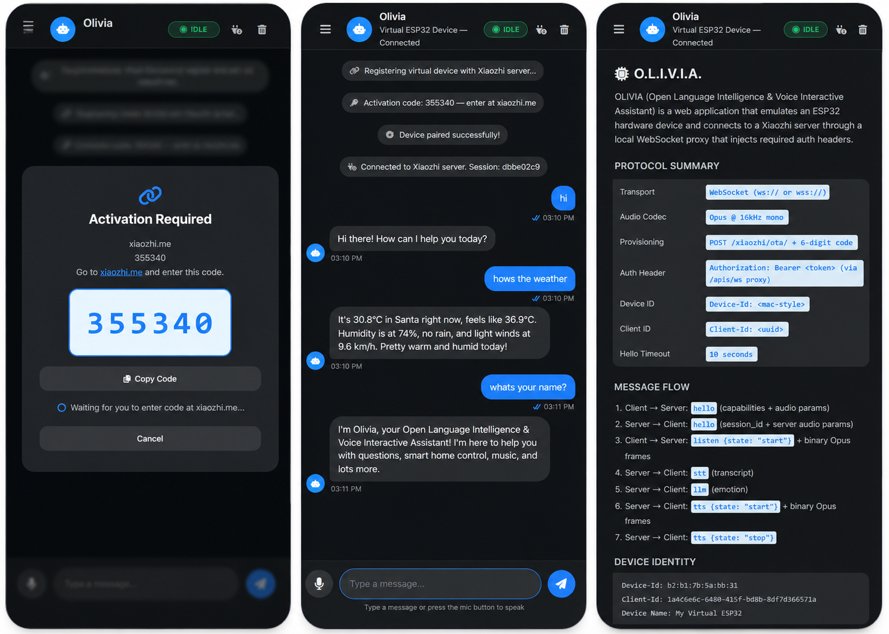
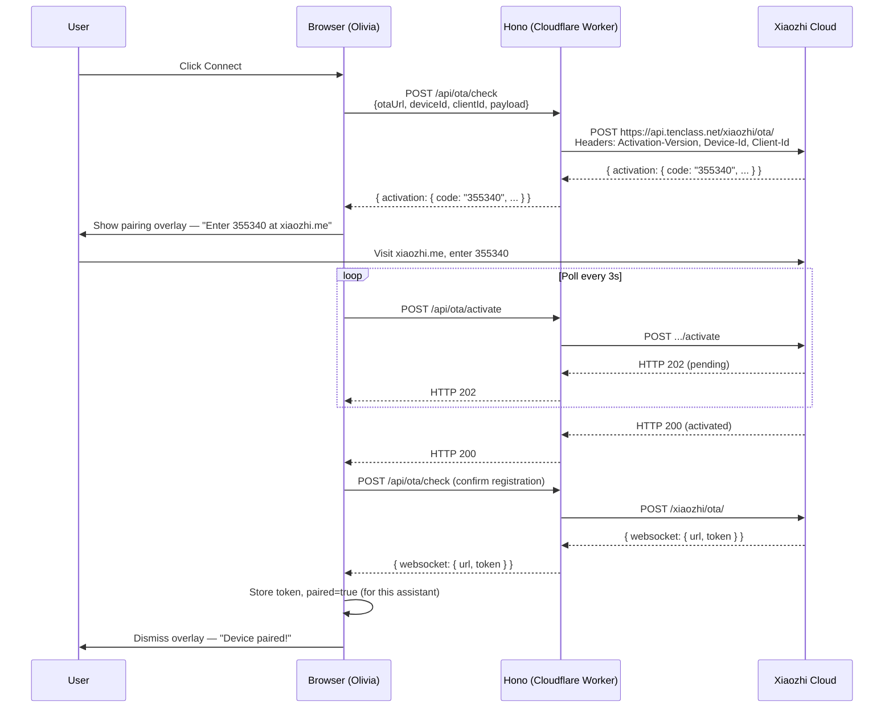
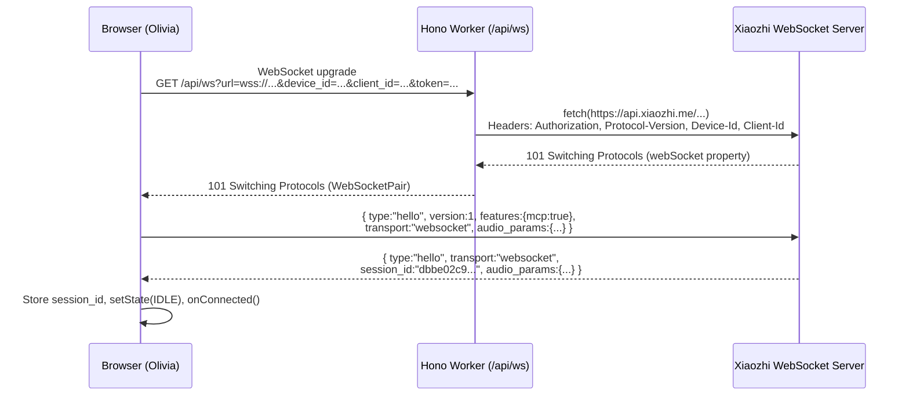
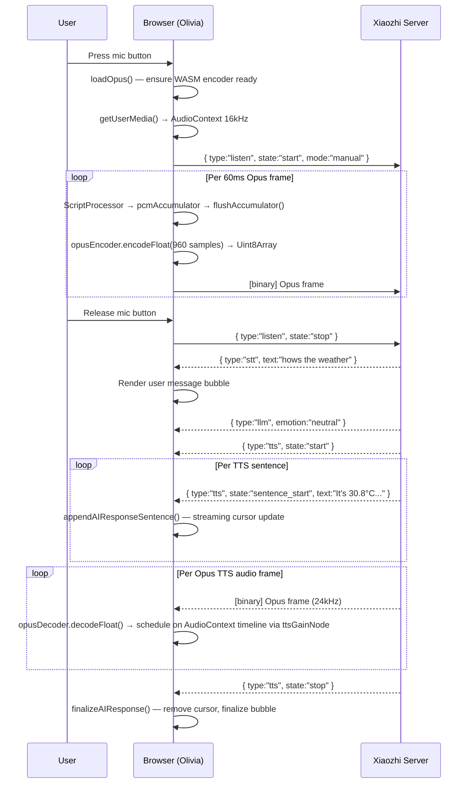
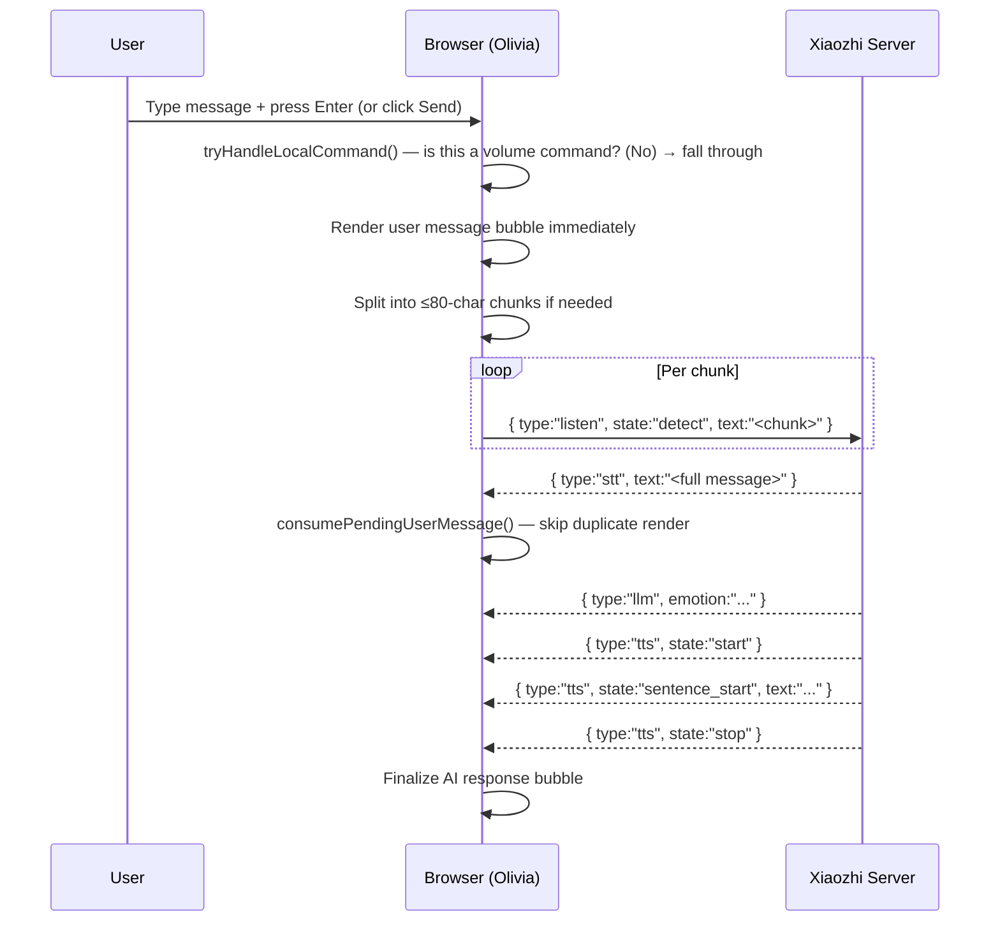
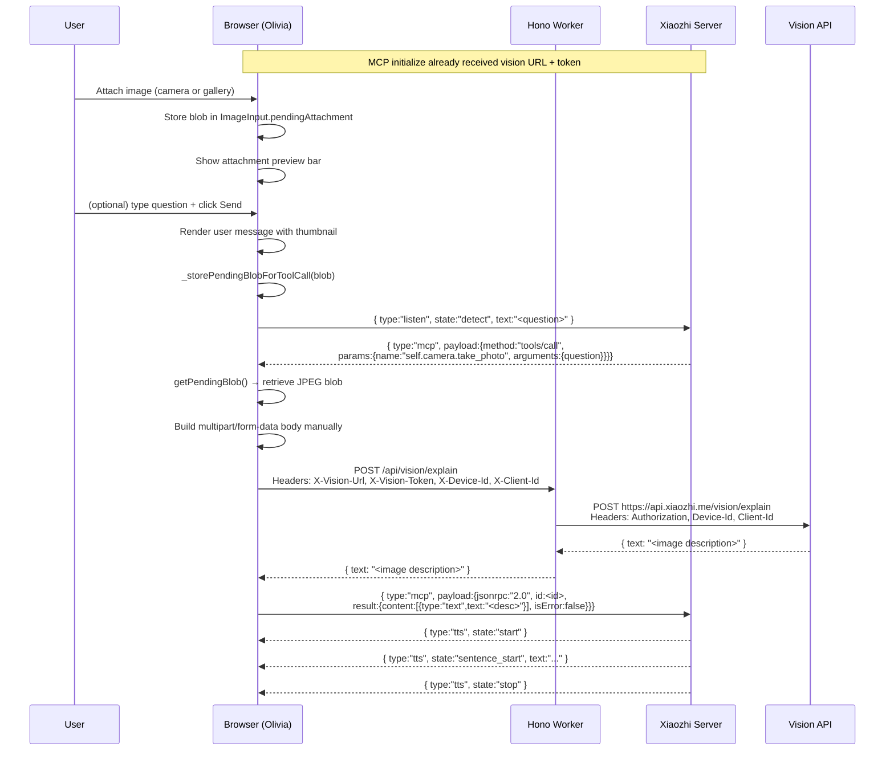
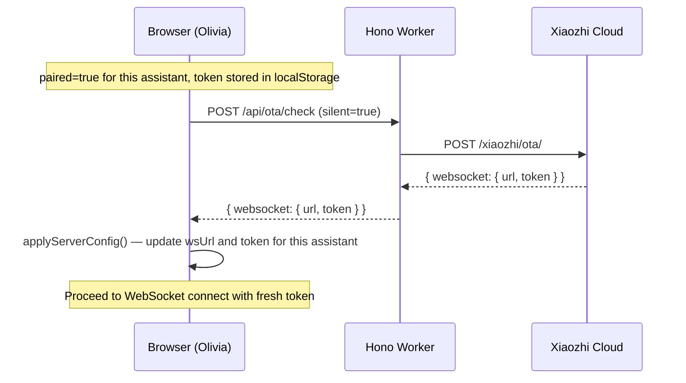

<div align="center">



<br/>
<br/>

# O.L.I.V.I.A.

### Multi-Assistant Virtual ESP32 Platform for Xiaozhi AI

<p align="center">
  
  
  
  
  
  
  
  
  
  
  
  
</p>

</div>

---

**Olivia** — full name **O.L.I.V.I.A.** (Open Language Interactive Assistant) — is a browser-based virtual ESP32 device that faithfully emulates an official Xiaozhi ESP32 hardware device while adding browser-native capabilities such as a live camera viewfinder, photo gallery uploads, and a full messenger-style chat UI. It connects directly to the Xiaozhi cloud using the same OTA provisioning, WebSocket handshake, binary Opus audio protocol, and MCP (Model Context Protocol) tool-call architecture used by real ESP32 firmware — without any physical hardware.

What started as a single virtual device has grown into a full **multi-assistant AI platform**. Olivia is still presented to the outside world — and to the Xiaozhi cloud — as a device speaking the exact ESP32 protocol described above, but the application itself now hosts **any number of independent AI assistants** side by side, each with its own name, avatar, conversation history, pairing, connection, and settings. Under the hood, every assistant is its own self-contained virtual Xiaozhi device (its own `Device-Id`, `Client-Id`, WebSocket connection, and OTA pairing state), so the Xiaozhi backend always sees clean, isolated device sessions — but from the user's point of view there is only ever **one Olivia**, with multiple personalities living inside it, switchable like tabs in a chat app. You never manage "devices"; you manage **assistants**.

---

## Table of Contents

- [Why Olivia Exists](#why-olivia-exists)
- [Why Olivia? — Browser Advantages](#why-olivia--browser-advantages)
- [Features](#features)
- [Screenshots](#screenshots)
- [Architecture](#architecture)
- [Multi-Assistant Platform](#multi-assistant-platform)
- [Voice Pipeline](#voice-pipeline)
- [Vision Pipeline](#vision-pipeline)
- [OTA Provisioning and Pairing](#ota-provisioning-and-pairing)
- [MCP — Model Context Protocol](#mcp--model-context-protocol)
- [Theming (Light / Dark Mode)](#theming-light--dark-mode)
- [Assistant Avatars](#assistant-avatars)
- [Per-Assistant Speech Volume](#per-assistant-speech-volume)
- [Usage Guide](#usage-guide)
- [Installation](#installation)
- [Deployment](#deployment)
- [Project Structure](#project-structure)
- [Configuration](#configuration)
- [Data Storage & Persistence](#data-storage--persistence)
- [Sequence Diagrams](#sequence-diagrams)
- [FAQ](#faq)
- [Roadmap](#roadmap)
- [Contributing](#contributing)
- [License](#license)

---

## Why Olivia Exists

The [Xiaozhi ESP32 project](https://xiaozhi.me) is an open-source AI assistant ecosystem designed to run on physical ESP32 microcontroller hardware. To use Xiaozhi, you normally need a supported ESP32 development board, a microphone, a speaker, and firmware flashed directly onto the chip.

This hardware requirement creates a barrier: you cannot try the Xiaozhi cloud, experiment with its AI capabilities, or develop applications against it without owning and flashing specific hardware.

Olivia exists to close that gap — not by wrapping Xiaozhi in a generic chat interface, but by emulating the entire device identity, provisioning flow, and binary WebSocket protocol that a real ESP32 board speaks. The browser becomes the hardware. The Xiaozhi cloud cannot distinguish Olivia from a real device.

Specifically, Olivia solves the following:

- **Browser WebSockets cannot send custom HTTP headers.** The Xiaozhi server requires `Authorization: Bearer <token>`, `Device-Id`, `Client-Id`, and `Protocol-Version` headers on the WebSocket upgrade request. A browser client cannot set these. Olivia runs a Hono server on Cloudflare Workers that acts as a transparent header-injecting proxy — exactly as the reference Python `proxy.py` client from the `xiaozhi-esp32` repository does.

- **CORS blocks direct vision uploads.** The Xiaozhi vision API (`api.xiaozhi.me/vision/explain`) does not permit cross-origin browser POSTs. Olivia's server-side proxy forwards the multipart image upload with the required auth headers, making the vision pipeline work transparently from any browser.

- **OTA provisioning requires server-side logic.** The ESP32 firmware's `Ota::CheckVersion()` and `Ota::Activate()` calls use device-specific headers (`Activation-Version`, `Device-Id`, `Client-Id`, `User-Agent`, `Accept-Language`) that the browser cannot set on a cross-origin fetch. The Hono backend proxies both OTA calls, injecting the correct headers.

- **Real Opus encoding is required.** The Xiaozhi server rejects raw PCM16 audio with a server-side error. Olivia loads `libopus-wasm` (a WebAssembly build of libopus) to encode microphone PCM at 16 kHz mono into genuine 960-sample Opus frames before sending them over the WebSocket — matching the exact frame duration (`OPUS_FRAME_DURATION_MS = 60`) used by the ESP32 firmware.

---

## Why Olivia? — Browser Advantages

Even after a physical ESP32 is set up, Olivia offers capabilities that hardware cannot:

| Capability | Physical ESP32 | Olivia |
|---|---|---|
| **Camera source** | OV2640 / OV5640 chip | Device camera (front or rear) + photo gallery |
| **Image formats** | Raw JPEG only | JPEG, PNG, WebP, GIF, BMP, HEIC — auto-converted to JPEG |
| **Camera switching** | Hardware wiring | Front/rear toggle in browser |
| **Chat history** | Not available | Full conversation log with timestamps, per assistant |
| **Protocol debug console** | Serial monitor only | Live debug panel in the browser with timestamped log entries |
| **Device identity** | Burned into firmware | Persistent per-browser, resettable, and manually configurable |
| **Multi-platform** | One physical device | Any desktop, tablet, or phone with a modern browser |
| **Deployment** | Must flash firmware | Deploy to Cloudflare Pages — share a URL |
| **Dark mode** | N/A (no screen) | Automatic via `prefers-color-scheme`, plus a manual ☀️/🌙 override |
| **Text mode** | Wake word or button press | Typed messages via the Xiaozhi `listen{detect}` protocol |
| **Pairing reset** | Factory reset firmware | One-click "Reset Pairing" in settings |
| **Protocol version** | Fixed at compile time | Selectable v1 / v2 / v3 at runtime |
| **Frame duration** | Fixed 60 ms | Selectable 20 ms / 40 ms / 60 ms |
| **Number of assistants** | One device, one identity, one personality | Unlimited independent assistants, switchable instantly in one app |
| **Personalization** | N/A | Per-assistant profile picture (avatar) and per-assistant speech volume |

---

## Features

### Multi-Assistant Platform

- **Unlimited independent assistants** — create as many virtual ESP32 identities as you want, each fully isolated from the others
- **Instant switching** — click between assistants like switching tabs or channels in a chat app; background assistants keep their WebSocket connection alive
- **True per-assistant isolation** — independent WebSocket connection, chat history, OTA pairing/token, device identity (`Device-Id` / `Client-Id`), avatar, and local settings
- **Add / Rename / Delete** assistants directly from the sidebar, with a guard preventing deletion of the last remaining assistant
- **Per-assistant gear icon** — opens a settings panel scoped to that specific assistant without switching the active view
- **Fully persistent** — every assistant, its conversation history, pairing state, avatar, volume, and settings survive a full page reload or browser restart, all backed by `localStorage`
- **Zero protocol changes** — the underlying Xiaozhi WebSocket/OTA/MCP protocol implementation is shared and byte-for-byte identical to the original single-device implementation; multi-assistant support is purely an orchestration layer built on top of it

See [Multi-Assistant Platform](#multi-assistant-platform) below for the full architecture and isolation guarantees.

### AI & Conversation

- **Full Xiaozhi AI integration** — connects to the official Xiaozhi cloud (`wss://api.xiaozhi.me/xiaozhi/v1/`), independently for every assistant
- **Streaming text-to-speech** — AI responses stream sentence-by-sentence with a live typing cursor
- **Emotion support** — the server sends `llm` emotion events (`happy`, `sad`, `angry`, `surprised`, `neutral`, `excited`, `thinking`, `confused`) decoded and available for UI rendering
- **Conversation history** — every exchange is stored per assistant with timestamps and a sidebar preview
- **Text message chunking** — long messages are automatically split at sentence boundaries into ≤ 80-character chunks to respect the server's `listen{detect}` wake-word channel limit, then reassembled by the LLM

### Voice

- **Real-time microphone capture** — Web Audio API at 16 kHz mono with echo cancellation, noise suppression, and auto gain control
- **Genuine Opus encoding** — `libopus-wasm` v0.2.0 loaded from jsDelivr CDN encodes raw PCM Float32 into standard 960-sample (60 ms) Opus frames; the server requires real Opus — raw PCM triggers a server error
- **Push-to-talk** — hold the mic button for PTT mode
- **Toggle mode** — click the mic button to start continuous auto-VAD listening; click again to stop
- **Multi-version binary protocol** — sends Opus frames with the correct binary framing for protocol version 1 (raw), version 2 (16-byte timestamped header), or version 3 (4-byte lightweight header)
- **Streaming TTS playback** — incoming Opus frames from the server are decoded by `libopus-wasm` and scheduled on the Web Audio timeline for gapless, low-latency playback at 24 kHz
- **Live audio level meter** — real-time VU bar driven by `AnalyserNode.getByteFrequencyData()` during capture
- **TTS abort** — sending `abort{reason:"user_interruption"}` stops server playback and clears the local audio queue
- **Per-assistant speech volume** — every assistant remembers its own local playback volume; see [Per-Assistant Speech Volume](#per-assistant-speech-volume)

### Vision

- **Browser camera viewfinder** — live `<video>` stream using `getUserMedia` with front/rear switching; the switch button only appears when multiple cameras are detected
- **Photo capture** — canvas-based JPEG snapshot from the live camera stream at 0.9 quality
- **Retake flow** — preview captured photo before committing; retake if unsatisfied
- **Gallery upload** — file picker accepting JPEG, PNG, WebP, GIF, BMP, HEIC, and any `image/*` type
- **Automatic JPEG conversion** — non-JPEG uploads are converted to JPEG via an offscreen canvas before sending, mirroring the firmware's always-JPEG camera output
- **Attachment preview bar** — thumbnail and filename shown above the text input before sending
- **Vision API proxy** — images are POSTed as raw binary JPEG in `multipart/form-data` to `/api/vision/explain` on the Hono server, which injects auth headers and forwards to the Xiaozhi vision endpoint; the server response URL (`http://`) is normalised to `https://` before forwarding
- **MCP tool-call architecture** — instead of uploading images directly, Olivia stores the pending image blob and sends the user's question via `listen{detect}`, triggering the Xiaozhi LLM to issue a `tools/call` for `self.camera.take_photo`; the blob is retrieved, uploaded, and the JSON-RPC result is returned to the server — exactly as the ESP32 firmware's `mcp_server.cc` does

### Device Emulation

- **Virtual device identity** — auto-generates a persistent MAC-style `Device-Id` (lowercase `xx:xx:xx:xx:xx:xx` format, matching the ESP32 firmware's `%02x` format) and a UUID v4 `Client-Id` on first launch; both are persisted in `localStorage`
- **One virtual device per assistant** — every assistant owns a private `DeviceEmulator`, `ProvisioningManager`, `ProtocolClient`, and `VisionCapability` instance, so pairing, state, and vision capabilities never leak between assistants
- **MAC address case normalisation** — automatically corrects any uppercase MAC addresses saved by older app versions (the Xiaozhi server closes the WebSocket connection immediately on uppercase `Device-Id`)
- **Configurable device name** — sets the `board.name` field in the OTA provisioning payload internally (this field is now hidden from the UI — every assistant presents itself as **O.L.I.V.I.A.**, see [Assistant Avatars](#assistant-avatars))
- **State machine** — mirrors the ESP32 firmware's `DeviceState` enum: `UNKNOWN → STARTING → IDLE → CONNECTING → LISTENING → SPEAKING → ERROR` with real-time UI updates on each transition
- **Pairing persistence** — `paired` flag and access token stored per assistant in `localStorage`; survives page reloads
- **Pairing reset** — clears token and `paired` flag so a fresh OTA provisioning run is triggered on next connect
- **Session ID display** — shows the current session UUID returned in the server's `hello` response

### Theming

- **Manual light / dark toggle** — click the ☀️/🌙 button in the sidebar header to override the theme at any time
- **System preference respected by default** — when no manual override has been set, Olivia automatically follows the OS/browser `prefers-color-scheme`
- **Persisted** — your manual choice is saved to `localStorage` (`olivia_theme_preference`) and survives reloads
- **Full dark-mode contrast pass** — active sidebar items, message bubbles, and all panels were audited for readability in both themes

See [Theming (Light / Dark Mode)](#theming-light--dark-mode) below for implementation details.

### Assistant Avatars

- **Per-assistant profile pictures** — upload a custom avatar (PNG/JPG/JPEG/WEBP) for each assistant from the sidebar or the settings panel
- **Automatic processing** — uploads are resized and re-encoded client-side to a 256×256 JPEG before being stored, keeping `localStorage` usage small
- **Shown everywhere** — the chat header, the typing indicator, the sidebar assistant list, and AI message bubbles all display the correct per-assistant avatar
- **Bundled default avatar** — a hand-designed robot SVG (`olivia-avatar-default.svg`) is shown for any assistant that hasn't set a custom image; it never depends on Font Awesome or a network request
- **Cleaned up automatically** — deleting an assistant also removes its stored avatar, leaving no orphaned data
- **Distinct assistants, unified branding** — assistants can look and sound different from each other, while the app itself always presents as **O.L.I.V.I.A.** in the sidebar header

See [Assistant Avatars](#assistant-avatars) below for storage format details.

### Per-Assistant Speech Volume

- **Speaker button** in the chat header opens a floating slider popup — live update, no Save button, closes on outside click
- **Each assistant remembers its own volume** (default 100%), persisted across reloads and browser restarts
- **Natural-language control** — just tell Olivia things like *"lower your volume"*, *"mute yourself"*, *"set your volume to 60%"* — recognized and handled locally, never sent to the Xiaozhi server
- **Local-only** — controls Olivia's browser playback gain only, never Xiaozhi's TTS voice/agent configuration
- **Future-ready extension point** — an unwired `handleClientAction()` hook is already implemented so a future server-driven `client_action` message can control the same volume system without any protocol changes

See [Per-Assistant Speech Volume](#per-assistant-speech-volume) below for the full technical breakdown.

### Protocol

- **Full Xiaozhi WebSocket protocol** — implements the complete message flow including `hello` handshake (device → server), server `hello` ACK, `listen{start/stop/detect}`, `stt`, `llm`, `tts{start/sentence_start/stop}`, `abort`, `system`, `alert`, `mcp`, and `custom`
- **10-second hello timeout** — matches the ESP32 firmware's `WebsocketProtocol::OpenAudioChannel()` timeout
- **Protocol version selection** — v1 (raw Opus), v2 (16-byte header with timestamp), v3 (4-byte lightweight header); binary framing applied on send and stripped on receive
- **Configurable frame duration** — 20 ms, 40 ms, or 60 ms Opus frames
- **Listening mode** — `auto` (server-side VAD triggers stop), `manual` (explicit stop), `realtime`
- **Auth failure detection** — WebSocket close codes 1008, 4001–4003, 4401, 4403 and reason strings matching `auth|token|unauthorized|forbidden` are identified and reported with a clear "Try resetting pairing" message
- **`XiaozhiDebug` global** — every module is exposed on `window.XiaozhiDebug` for browser console debugging: `protocol`, `settings`, `provisioning`, `device`, `audio`, `chat`, `ui`, `app`, `logger`, `theme`, plus helpers `quickTest(message)`, `sendDetect(text)`, and `opusStatus()`

### Browser UI

- **Messenger-style layout** — left sidebar (device status, navigation tabs, assistant list, audio meter) + main chat area with message bubbles
- **Responsive design** — full-width chat on mobile (≤ 768 px); sidebar becomes a slide-in overlay triggered by a hamburger button
- **Dark mode** — automatic via CSS `prefers-color-scheme: dark`, plus a manual toggle (see [Theming](#theming-light--dark-mode))
- **Dynamic viewport height** — uses `100dvh` (dynamic viewport height) so the input area is never obscured by the mobile browser chrome/address bar
- **iOS viewport fix** — `-webkit-fill-available` fallback for browsers without `dvh` support
- **Settings panel** — slides in from the left, scoped to a single assistant, with all configurable parameters grouped by category
- **Protocol debug console** — switchable tab showing timestamped log entries for BOOT, AUTH, WS, CHAT, PROTO, AUDIO, ERROR, WARN, INFO, STATE, MCP, and VISION events; supports clear and copy-to-clipboard
- **Info panel** — shows the full protocol summary, message flow, and live device identity (Device-Id, Client-Id, device name, pairing status, URLs, protocol version)
- **Activation overlay** — full-screen modal displaying the 6-digit activation code with copy button; polling spinner updates in real time; cancel aborts provisioning
- **Loading overlay** — shown during initialisation with a CSS spinner
- **Toast notifications** — bottom-right notification stack for success, info, warning, and error states; auto-dismiss after 4 seconds
- **Typing indicator** — animated three-dot bubble with a status string (`AI is thinking...`, `Sending to AI...`) shown between send and first TTS sentence, using the active assistant's avatar
- **Streaming cursor** — blinking `▋` appended to AI response text while the TTS sentence stream is in progress
- **Message image thumbnails** — user messages that include a vision attachment show an inline thumbnail above the text
- **Theme toggle button** — ☀️/🌙 icon in the sidebar header
- **Speaker / volume popup** — per-assistant volume slider in the chat header
- **Assistant sidebar** — scrollable list of all assistants with avatar, name, live connection-status dot, and a hover-revealed gear icon for scoped settings
- **Clickable avatars** — click any avatar (sidebar, chat header, or settings panel) to upload a new profile picture for that assistant

---

## Screenshots

The banner above shows Olivia in three states. Below are described the key views:

### Activation / Pairing

The activation overlay appears the first time you connect a given assistant. It displays the 6-digit code returned by the OTA provisioning endpoint and polls automatically. Once you enter the code at [xiaozhi.me](https://xiaozhi.me), the overlay dismisses and the WebSocket connection proceeds.

### Multi-Assistant Sidebar

The left sidebar lists every assistant you've created, each with its own avatar, name, and a live status dot (grey = disconnected, green = connected). Click any entry to switch instantly — background assistants keep their connection alive. A gear icon appears on hover for opening that assistant's scoped settings, and a ☀️/🌙 button at the top of the sidebar toggles the light/dark theme app-wide.

### Chat

The main view shows a messenger-style chat window for the currently selected assistant. User messages appear in blue bubbles on the right; AI responses stream in grey bubbles on the left, next to that assistant's avatar, with a blinking cursor while audio is playing.

### Voice Mode

While the microphone is active, the left sidebar shows a live audio level meter (VU bar), the device avatar pulses orange, and the state chip in the header reads `LISTENING`. When the AI responds, the avatar pulses purple and the chip reads `SPEAKING`.

### Speech Volume

Clicking the speaker icon in the chat header opens a small floating popup with a slider (0–100%) and a live percentage label. Dragging it adjusts playback volume instantly, with no Save button required, and the setting is remembered per assistant.

### Vision

Attaching an image adds a thumbnail preview bar above the text input. The user can optionally type a question. When sent, the image is held as a pending blob while the question travels to the LLM. The LLM calls `self.camera.take_photo` via MCP, triggering the upload.

### Protocol Debug Console

Switching to the Debug tab in the sidebar shows a live log with colour-coded tags. Each entry includes a millisecond-precise timestamp.

### Info Panel

The Info tab shows the full protocol summary table, message flow list, and live device identity (Device-Id, Client-Id, device name, pairing status, WebSocket URL, OTA URL, protocol version, frame duration) for the currently selected assistant.

---

## Architecture

Olivia has two layers:

1. **Hono server** (`src/index.tsx`) — deployed to Cloudflare Pages/Workers. Serves the static HTML/CSS/JS shell and exposes three API routes that act as server-side proxies for operations the browser cannot perform directly. This layer is completely unaware of assistants — every session, regardless of which assistant it belongs to, talks to the exact same three proxy routes.

2. **Browser application** (`public/static/app.js`) — a single vanilla JavaScript file (~5000+ lines) organised as self-contained IIFE modules. All ESP32 protocol logic runs in the browser. The browser layer is itself organised as a shared shell (sidebar, settings, theme, avatars, volume) wrapped around any number of independent per-assistant session bundles.

```
Browser
  │
  ├── AssistantManager      (localStorage-backed store of every assistant's data)
  ├── SessionManager        (creates/switches/deletes independent per-assistant session bundles)
  │      │
  │      ├── Assistant A session bundle
  │      │     ├── DeviceEmulator        (state machine: IDLE/CONNECTING/LISTENING/SPEAKING/ERROR)
  │      │     ├── ProvisioningManager   (OTA check → activation code → polling → paired)
  │      │     ├── ProtocolClient        (WebSocket to /api/ws proxy → Xiaozhi server)
  │      │     ├── ChatEngine            (text/voice/image send, message history, streaming AI response)
  │      │     └── VisionCapability      (stores vision URL + token from MCP initialize)
  │      │
  │      └── Assistant B, C, … — same independent bundle, running in parallel
  │
  ├── ThemeManager                    (light/dark preference, manual override + persistence)
  ├── AvatarStorage / AvatarSystem    (per-assistant profile picture storage + UI)
  ├── VolumeStorage / VolumeSystem    (per-assistant local playback volume + NL command interception)
  ├── UIController                    (DOM rendering, sidebar, settings panel, event bindings, responsive layout)
  ├── SettingsManager                 (thin backwards-compatible shim over AssistantManager)
  ├── AudioEngine                     (mic capture → libopus-wasm → Opus frames / TTS decode →
  │                                     shared gain node → Web Audio; shared hardware pipeline,
  │                                     routed to whichever assistant is active)
  ├── ImageInput                      (camera viewfinder, gallery picker, pending blob management)
  └── AppController                   (boot sequence, orchestrates all modules, connect/disconnect flow)
       │
       ↓ HTTP / WebSocket (one connection per connected assistant)
Cloudflare Workers (src/index.tsx — Hono)
  │
  ├── GET  /api/ws           → WebSocket proxy (injects Authorization, Device-Id, Client-Id,
  │                            Protocol-Version headers the browser cannot set)
  ├── POST /api/ota/check    → Proxies POST to OTA URL with device headers
  ├── POST /api/ota/activate → Proxies POST to OTA /activate endpoint
  └── POST /api/vision/explain → Proxies multipart/form-data to vision endpoint
                                  (normalises http:// → https://)
       │
       ↓ HTTPS / WSS
Xiaozhi Cloud (api.xiaozhi.me / api.tenclass.net)
  │
  ├── OTA endpoint          (https://api.tenclass.net/xiaozhi/ota/)
  ├── WebSocket endpoint    (wss://api.xiaozhi.me/xiaozhi/v1/)
  ├── Vision endpoint       (https://api.xiaozhi.me/vision/explain)
  └── LLM + TTS             (server-side; streams Opus audio and JSON events to client)
```

### Cloudflare Workers WebSocket Proxy — Critical Notes

The proxy at `/api/ws` has three non-obvious requirements specific to the Cloudflare Workers runtime. These hold per-connection, regardless of how many assistants are connected concurrently:

1. **`fetch()` for WebSocket upgrade must use `https://`, not `wss://`.** Passing `wss://` to `fetch()` causes the `webSocket` property on the response to be `null`. The proxy rewrites `wss://` → `https://` before calling `fetch()`.

2. **`binaryType` must be set to `'arraybuffer'` before `accept()`.** On Cloudflare compatibility dates ≥ 2026-03-17, binary frames default to `Blob`. The proxy sets `upstream.binaryType = 'arraybuffer'` before `upstream.accept()` to ensure Opus audio frames are forwarded as raw `ArrayBuffer`.

3. **`allowHalfOpen: true` on both `accept()` calls.** Required so close frames on each side can be coordinated independently during proxy teardown.

---

## Multi-Assistant Platform

### One App, Many Assistants — Not Many Devices

Every assistant you create is a fully independent virtual Xiaozhi ESP32 device internally (its own `Device-Id`, `Client-Id`, OTA pairing/token, and WebSocket connection) — but Olivia deliberately hides that plumbing from you. You never see a device picker or a MAC address by default; you see a friendly sidebar of **assistants** with names and avatars, exactly like a roster of chat contacts.

### Module Responsibilities

| Module | Responsibility |
|---|---|
| `AssistantManager` | Single source of truth for every assistant's data (identity, settings, pairing, avatar reference, conversation history) — persisted to `localStorage` under `olivia_assistants_v1` |
| `SessionManager` | Creates, switches, renames, and deletes assistants; orchestrates the lifecycle of each assistant's independent session bundle (`DeviceEmulator`, `ProvisioningManager`, `ProtocolClient`, `ChatEngine`, `VisionCapability`) |
| `SettingsManager` | Thin backwards-compatible shim so older single-device code paths keep working unmodified on top of `AssistantManager` |
| `UIController` | Renders the sidebar assistant list, the scoped settings panel, the chat header, and all responsive/theme-aware DOM updates |
| `ChatEngine` | Per-assistant text/voice/image sending, message history assembly, and streaming AI response rendering |
| `ProtocolClient` | Per-assistant Xiaozhi WebSocket connection — completely unmodified from the single-device implementation, simply instantiated once per assistant |

### Isolation Guarantees

- **Connections** — connecting Assistant A never opens or affects Assistant B's WebSocket; switching the active assistant never reconnects, disconnects, or recreates an existing connection
- **Conversations** — messages, streaming state, and history are stored and rendered per assistant; nothing is ever mixed
- **Pairing** — each assistant has its own OTA activation code, token, and `paired` flag
- **Identity** — each assistant has its own `Device-Id` / `Client-Id` pair, generated and normalised exactly as described in [OTA Provisioning and Pairing](#ota-provisioning-and-pairing)
- **Personalization** — avatar and local speech volume are keyed per assistant and cleaned up automatically when an assistant is deleted

These guarantees were verified with a dedicated automated test harness (12 core-logic tests covering isolation, persistence, rename, and delete-guard behavior, plus 5 dedicated connection-isolation tests, all passing), and confirmed again with in-browser Playwright smoke testing showing zero console errors across a full boot → create → switch → connect → delete cycle.

### Known Limitations

- **Add Assistant** currently uses a simple `prompt()` dialog rather than an inline sidebar input
- **No reconnect-on-reload** — this is intentional: a page reload does not attempt to silently resume every assistant's WebSocket connection; you reconnect assistants manually, the same way you would reconnect a single device
- **Mobile gear icon** — the per-assistant settings gear is currently revealed on hover and may need a tap-and-hold or always-visible affordance on touch-only devices

See [Roadmap](#roadmap) for planned improvements.

---

## Voice Pipeline

Every assistant runs an independent instance of this pipeline; the diagrams below apply identically regardless of how many assistants are connected simultaneously — only one assistant's audio is routed through the shared hardware (microphone / speakers) at a time, whichever is currently active.

Voice input flows through the following stages:

```
User microphone
      │
      ▼
navigator.mediaDevices.getUserMedia()
  { channelCount: 1, sampleRate: 16000,
    echoCancellation: true, noiseSuppression: true, autoGainControl: true }
      │
      ▼
AudioContext @ 16 kHz (separate from TTS playback context @ 24 kHz)
      │
      ▼
MediaStreamSource → AnalyserNode (level meter) + ScriptProcessorNode (4096-sample buffer)
      │
      ▼  onaudioprocess — appends Float32 samples to pcmAccumulator
      │
      ▼  flushAccumulator() — slices into exact 960-sample frames (60 ms @ 16 kHz)
      │                        uses flushInProgress guard to prevent race conditions
      ▼
libopus-wasm Encoder
  { sampleRate: 16000, channels: 1, application: Voip, frameSize: 960, bitrate: 24000 }
      │
      ▼  encodeFloat() → Uint8Array (raw Opus packet)
      │
      ▼
ProtocolClient.sendAudio(opusBuffer)
      │
      ▼  Binary frame wrapping (protocol version 1/2/3)
      │
      ▼
WebSocket → /api/ws proxy → Xiaozhi WebSocket server
```

TTS playback reverses the flow:

```
Xiaozhi server
      │  binary WebSocket frame (Opus @ 24 kHz)
      ▼
ProtocolClient.handleBinaryMessage() — strips version header if v2/v3
      │
      ▼
AudioEngine.enqueueTTSChunk()
      │
      ▼
drainTTSQueue() — runs asynchronously
      │
      ├── Path 1: libopus-wasm Decoder.decodeFloat() → Float32Array
      │   (24 kHz mono)
      │
      └── Path 2: Web Audio decodeAudioData() fallback (OGG/Opus container)
      │
      ▼
AudioContext.createBuffer() + createBufferSource()
  source.connect(ttsGainNode)       ← shared gain node, see Per-Assistant Speech Volume
  source.start(ttsNextStartTime)    ← pre-scheduled for gapless playback
  ttsNextStartTime += frameDurationS
```

The pre-scheduling clock (`ttsNextStartTime`) is the key to gapless TTS: each Opus frame is scheduled at exactly the end of the previous frame's duration, rather than waiting for an `onended` callback (which introduces an audible gap between every frame). A single shared `GainNode` (`ttsGainNode`) sits between every decoded frame and `audioContext.destination`, giving each assistant's saved volume instant, click-free control over playback loudness — see [Per-Assistant Speech Volume](#per-assistant-speech-volume).

---

## Vision Pipeline

The vision pipeline mirrors `Esp32Camera::Explain()` from the official ESP32 firmware (`xiaozhi-esp32/main/boards/common/esp32_camera.cc`), independently for every assistant that owns a pending image:

```
User selects image
  │
  ├── Camera path:
  │     getUserMedia (video) → <video> live feed → canvas.drawImage() → canvas.toDataURL()
  │     → Blob (JPEG @ 0.9 quality) → setAttachment(blob, name, dataUrl)
  │
  └── Gallery path:
        <input type="file"> → FileReader.readAsDataURL() → setAttachment(blob, name, dataUrl)
        Non-JPEG → convertToJpeg() via offscreen canvas → Blob (JPEG @ 0.85 quality)
      │
      ▼
ImageInput.pendingAttachment.blob  (held in memory, scoped to the active assistant)
      │
      ▼
User types optional question + clicks Send
      │
      ▼
ChatEngine.sendImageMessage(blob, question, name, dataUrl)
      │
      ├── Renders user message bubble with thumbnail
      ├── Stores blob in ImageInput._storePendingBlobForToolCall()
      ├── Sends question via ProtocolClient.sendListenDetect(question.slice(0, 80))
      │     → Server's LLM determines vision is needed
      │     → Server sends MCP tools/call: self.camera.take_photo
      │
      ▼
ProtocolClient.handleMCP() — tools/call branch
      │
      ├── ImageInput.getPendingBlob() → retrieves the stored JPEG blob
      ├── Builds multipart/form-data body manually:
      │     --boundary
      │     Content-Disposition: form-data; name="question"
      │     <question text>
      │     --boundary
      │     Content-Disposition: form-data; name="file"; filename="camera.jpg"
      │     Content-Type: image/jpeg
      │     <raw JPEG bytes>
      │     --boundary--
      │
      ▼
POST /api/vision/explain (Hono proxy)
  Headers: X-Vision-Url, X-Vision-Token, X-Device-Id, X-Client-Id, Content-Type
      │
      ▼
Hono validates host → normalises http:// → https:// → forwards to api.xiaozhi.me
      │
      ▼
Xiaozhi Vision API → AI image description → plain text or JSON { "text": "..." }
      │
      ▼
MCP JSON-RPC result sent back over WebSocket:
  { type:"mcp", payload:{ jsonrpc:"2.0", id:<tool_id>,
      result:{ content:[{type:"text", text:"<description>"}], isError:false }}}
      │
      ▼
Server feeds tool result to LLM → TTS sentence stream → Browser audio playback
```

**Key distinction between camera and gallery uploads:** The image source (live camera capture vs. file picker) is normalised before storage — both produce a `Blob` with type `image/jpeg` (or are converted to one). From the perspective of the MCP tool handler and the vision proxy, there is no difference between a camera photo and a gallery image.

---

## OTA Provisioning and Pairing

OTA (Over-the-Air) in the Xiaozhi ecosystem refers to the initial device registration and credential provisioning flow, not a firmware update. It mirrors the `Ota::CheckVersion()` and `Ota::Activate()` functions in the official `xiaozhi-esp32` firmware, and runs independently for every assistant.

### Flow

```
1. Browser → /api/ota/check (POST)
   Body: { otaUrl, deviceId, clientId, payload: { device info JSON } }
   Hono adds: Activation-Version, Device-Id, Client-Id, User-Agent, Accept-Language headers
   Forwards to: https://api.tenclass.net/xiaozhi/ota/
   │
   ├── Response A: no activation block, has token → device is registered
   │     AssistantManager.set(assistantId, 'paired', true)
   │     AssistantManager.set(assistantId, 'token', token)
   │     → connect WebSocket immediately
   │
   └── Response B: activation block present
         { activation: { code: "355340", message: "...", timeout_ms: 300000 } }
         → show pairing overlay with the 6-digit code, scoped to this assistant

2. Browser polls /api/ota/activate every 3 seconds (up to 100 attempts ≈ 5 min)
   User visits xiaozhi.me and enters the code
   │
   ├── HTTP 202 → still pending → keep polling
   │
   └── HTTP 200 → activation confirmed
         → call /api/ota/check again to confirm registration and fetch final token
         → if check returns no activation block: mark this assistant as paired
         → dismiss pairing overlay → open WebSocket connection

3. On subsequent connects: silent OTA refresh (provision(silent=true))
   Fetches latest token and WebSocket URL for this assistant; handles re-pairing
   if the server reset the device
```

### Device Identity Payload

When POSTing to the OTA endpoint, Olivia sends a JSON body that mirrors the ESP32 `CheckVersion()` payload — one such payload per assistant, built from that assistant's own identity:

```json
{
  "version": 2,
  "language": "en-US",
  "flash_size": 0,
  "minimum_free_heap_size": 0,
  "mac_address": "<device_id>",
  "uuid": "<client_id>",
  "chip_model_name": "web-client",
  "application": {
    "name": "xiaozhi-web-client",
    "version": "1.0.0",
    "compile_time": "<ISO timestamp>",
    "idf_version": "5.0",
    "elf_sha256": ""
  },
  "board": {
    "type": "web-client",
    "name": "O.L.I.V.I.A.",
    "ip": "127.0.0.1",
    "mac": "<device_id>"
  }
}
```

### MAC Address Format

The Xiaozhi server authenticates `Device-Id` case-sensitively. The ESP32 firmware generates the MAC address using `%02x` (lowercase). Olivia enforces lowercase at generation time and also normalises any stored uppercase MAC on load, clearing that assistant's pairing state so the corrected ID is re-provisioned.

---

## MCP — Model Context Protocol

MCP is the JSON-RPC 2.0 based capability negotiation and tool-call protocol used between the Xiaozhi server and connected devices. It allows the server's LLM to call device-side "tools" — such as the camera — and receive structured results. Each assistant negotiates its own MCP capabilities independently.

All MCP messages are transported as JSON text frames over the existing Xiaozhi WebSocket connection, wrapped in `{ type: "mcp", session_id: "...", payload: { ...json-rpc... } }`.

### Initialize Handshake

When the WebSocket connection is established, the server sends an `initialize` request:

```json
{
  "type": "mcp",
  "payload": {
    "jsonrpc": "2.0",
    "id": 1,
    "method": "initialize",
    "params": {
      "capabilities": {
        "vision": {
          "url": "http://api.xiaozhi.me/vision/explain",
          "token": "<vision_token>"
        }
      }
    }
  }
}
```

Olivia extracts `capabilities.vision.url` and `capabilities.vision.token` into that assistant's `VisionCapability` instance (mirroring `Esp32Camera::ParseCapabilities()` in `mcp_server.cc`), then responds:

```json
{
  "type": "mcp",
  "session_id": "<session_id>",
  "payload": {
    "jsonrpc": "2.0",
    "id": 1,
    "result": {
      "protocolVersion": "2024-11-05",
      "capabilities": { "tools": {} },
      "serverInfo": { "name": "xiaozhi-web-client", "version": "1.0.0" }
    }
  }
}
```

**Note:** The server sends the vision URL as `http://` even though the actual endpoint requires `https://`. This is a known quirk of the Xiaozhi server. Olivia's `/api/vision/explain` proxy normalises the URL to `https://` before forwarding.

### tools/list

The server queries available device tools:

```json
{ "method": "tools/list", "id": 2 }
```

Olivia responds with the `self.camera.take_photo` tool if and only if a vision capability URL was received during `initialize`:

```json
{
  "result": {
    "tools": [{
      "name": "self.camera.take_photo",
      "description": "Always remember you have a camera. If the user asks you to see something, use this tool to take a photo and then explain it.\nArgs:\n  `question`: The question that you want to ask about the photo.\nReturn:\n  A JSON object that provides the photo information.",
      "inputSchema": {
        "type": "object",
        "properties": { "question": { "type": "string" } },
        "required": ["question"]
      }
    }]
  }
}
```

This mirrors `McpServer::AddCommonTools()` in `mcp_server.cc` lines 100–121.

### tools/call — self.camera.take_photo

When the LLM determines the user wants vision analysis, the server calls:

```json
{
  "method": "tools/call",
  "params": {
    "name": "self.camera.take_photo",
    "arguments": { "question": "What is in this image?" }
  }
}
```

Olivia:
1. Retrieves the pending image `Blob` from `ImageInput.getPendingBlob()`
2. Converts to JPEG if needed
3. Manually builds a `multipart/form-data` body (no `FormData` API — the boundary and binary construction are done by hand to mirror the firmware's `http->PostBody()` call)
4. POSTs to `/api/vision/explain` (Hono proxy)
5. Parses the response — tries JSON `.text` field first, falls back to plain text
6. Returns the JSON-RPC result, wrapping the description exactly as `McpTool::Call()` does in `mcp_server.h` lines 285–305:

```json
{
  "result": {
    "content": [{ "type": "text", "text": "<AI description of the image>" }],
    "isError": false
  }
}
```

The server's `custom` message type is also already handled by `ProtocolClient` (`onCustom` callback) but is currently unused by any feature — it is the designated future extension point for server-driven client actions such as remote volume control; see [Per-Assistant Speech Volume](#per-assistant-speech-volume).

---

## Theming (Light / Dark Mode)

Olivia's dark mode was originally tied purely to the OS-level `prefers-color-scheme` media query. It now supports an explicit manual override while still respecting the system preference by default.

### Cascade

```
1. [data-theme="dark"]   → manual dark override (highest priority)
2. [data-theme="light"]  → manual light override (highest priority)
3. @media (prefers-color-scheme: dark) { :root:not([data-theme="light"]) } → system dark, only when no manual override is set
```

`ThemeManager` reads any saved preference from `localStorage` (`olivia_theme_preference`) on boot, applies the matching `data-theme` attribute to `<html>`, and wires the ☀️/🌙 toggle button in the sidebar header. Clicking the button flips the theme and persists the new choice; the icon swap itself is pure CSS (`[data-theme]` selectors toggle `.icon-sun` / `.icon-moon` visibility, no re-render needed).

As part of adding manual theming, the active-assistant sidebar item was also audited for dark-mode contrast: dedicated `--active-item-bg` / `--active-item-text` custom properties now guarantee readable text on the active item's highlight colour in both themes (previously, dark mode showed near-white text on a light-blue background, which was nearly invisible).

---

## Assistant Avatars

Each assistant can have its own profile picture, shown consistently across the whole app.

### Storage

```
AvatarStorage (localStorage layer)
  ├─ save(assistantId, dataUrl)  → localStorage.setItem('olivia_avatar_v1_<id>', dataUrl)
  ├─ load(assistantId)           → localStorage.getItem(...) | null
  └─ remove(assistantId)         → localStorage.removeItem(...)
```

- **Format**: JPEG at 85% quality, always resized to 256×256 pixels client-side before saving, keeping `localStorage` usage small
- **Fallback**: a bundled `olivia-avatar-default.svg` robot icon is shown for any assistant without a custom avatar — no network request required
- **Display locations**: chat header, typing indicator, sidebar assistant list, AI message bubbles, and the settings panel avatar editor all read from the same store and stay in sync
- **Cleanup**: deleting an assistant also calls `AvatarStorage.remove()`, so no orphaned images accumulate in `localStorage`

### Uploading

Click any avatar — in the sidebar, the chat header, or the settings panel — to open a file picker (PNG/JPG/JPEG/WEBP accepted). The image is resized and re-encoded entirely in the browser via an offscreen canvas; nothing is uploaded to a server.

> **Future path to Cloudflare R2**: `AvatarStorage`'s three-method interface (`save`/`load`/`remove`) was deliberately kept small so it can be swapped for `fetch()` calls to R2-backed Hono routes later, without touching any UI code — see [Roadmap](#roadmap).

---

## Per-Assistant Speech Volume

Every assistant has its own local speech-playback volume, independent of every other assistant and independent of the Xiaozhi server's own TTS voice/agent configuration.

### Control Surfaces

1. **Speaker button** in the chat header — opens a floating popup with a 0–100% slider and a live percentage label. There is no Save button: dragging the slider updates the volume instantly, and the popup closes when you click anywhere outside it.
2. **Natural language** — type things like:
   - *"lower your volume"*, *"turn yourself down"*, *"quieter"* (steps down 15 percentage points)
   - *"increase your volume"*, *"turn yourself up"*, *"louder"* (steps up 15 percentage points)
   - *"mute yourself"* / *"unmute"*
   - *"set your volume to 60%"*, *"volume 60"*, *"turn your volume to 25 percent"*
   - *"maximum volume"* / *"minimum volume"*

   These phrases are matched with an **anchored, whole-message** regex — a sentence that merely contains the word "volume" (e.g. "turn the volume up on the story you're telling me") is correctly left alone and sent to the AI as normal chat, never misfired as a command.

### How It Stays Local

```
Opus/PCM decode → AudioBufferSourceNode → shared ttsGainNode → audioContext.destination
                                                ↑
                                   AudioEngine.setVolume(0..1)
                                    (called by VolumeSystem)
```

A single shared `GainNode` sits between every decoded TTS audio source and the browser's speakers. Adjusting it only changes the loudness of audio the browser is about to play — it never sends anything over the Xiaozhi WebSocket, never changes server-side TTS voice or agent configuration, and never touches `AssistantManager`, pairing, or conversation state. A short 10 ms ramp (`gain.setTargetAtTime`) avoids audible clicks when the volume changes mid-sentence.

### Storage

```
localStorage["olivia_volume_v1_<assistantId>"] = "0.6"   // a single float 0..1
```

Never set → defaults to 100%. Removed automatically when that assistant is deleted. Switching the active assistant reloads its own saved volume and re-applies it to the shared gain node, so assistants never bleed volume settings into each other.

### Future: Server-Driven Volume

The Xiaozhi protocol's existing (and previously unused) `custom` message type already has an `onCustom` callback slot in `ProtocolClient`. A ready-made — but intentionally unwired — `VolumeSystem.handleClientAction()` handler can already process a future structured message such as:

```json
{ "type": "client_action", "action": "set_volume", "value": 0.4 }
```

Wiring it up in a future phase would take a single additional `protocol.on('custom', ...)` listener — no changes to the WebSocket handshake or any new message type required.

---

## Usage Guide

### Adding an Assistant
1. Click **+ Add Assistant** at the bottom of the assistant list in the sidebar
2. Enter a name (e.g. "Programming Mentor", "English Tutor")
3. The new assistant is created with a fresh virtual device identity (`Device-Id` / `Client-Id`) and is selected immediately

### Connecting to Xiaozhi
1. Click the gear ⚙️ icon on any assistant to open its settings, scoped to that assistant
2. Enter your Xiaozhi WebSocket URL (default: `wss://api.xiaozhi.me/xiaozhi/v1/`)
3. Click **Save**
4. Click **Connect** in the main header, or **Connect / Reconnect** in settings

### Pairing (OTA)
1. Open the assistant's settings → click **Pair / Provision** (or simply click Connect on a fresh assistant)
2. Olivia performs the same OTA registration flow a physical ESP32 would — see [OTA Provisioning and Pairing](#ota-provisioning-and-pairing)
3. Enter the 6-digit activation code shown at [xiaozhi.me](https://xiaozhi.me)
4. Each assistant keeps its own independent pairing state and token

### Switching Assistants
- Click any assistant in the sidebar — switching is instant, and any background connections stay alive
- The header title, avatar, status badge, and chat history all update to the newly selected assistant

### Renaming an Assistant
- Open the gear ⚙️ settings for an assistant → edit **Assistant Name** → Save
- The sidebar and header update immediately; no reconnect is needed

### Deleting an Assistant
- Open the gear ⚙️ settings → click **Delete Assistant** (red button) → confirm
- You cannot delete the last remaining assistant
- Deleting an assistant also removes its stored avatar and volume setting — nothing is left behind

### Uploading an Avatar
- Click any avatar for an assistant — in the sidebar, in the chat header, or inside its settings panel — and pick an image (PNG/JPG/JPEG/WEBP)
- The image is automatically resized to 256×256 and saved for that assistant only

### Adjusting Speech Volume
- Click the speaker icon in the chat header to open the volume slider, or
- Just tell Olivia in plain English — *"lower your volume"*, *"mute yourself"*, *"set your volume to 60%"* — see [Per-Assistant Speech Volume](#per-assistant-speech-volume)

### Switching Theme
- Click ☀️ (sun) in the sidebar header to switch to light theme
- Click 🌙 (moon) to switch to dark theme
- Your choice is remembered across reloads; leave it untouched to follow your OS setting automatically

### Disconnecting / Clearing Chat
- Click **Disconnect** in the chat header to close that assistant's WebSocket connection (other assistants are unaffected)
- Click **Clear Chat** to wipe that assistant's local conversation history

---

## Installation

### Requirements

- **Node.js** 18 or later
- **npm** 9 or later
- A Xiaozhi account at [xiaozhi.me](https://xiaozhi.me) (free) — required for device pairing
- (For Cloudflare deployment) A Cloudflare account with Wrangler authenticated

### Clone and Install

```bash
git clone https://github.com/your-username/olivia.git
cd olivia
npm install
```

### Local Development

Build the project first (required — Wrangler pages dev serves the compiled `dist/` directory):

```bash
npm run build
```

Then start the local development server:

```bash
npm run preview
# or with PM2:
pm2 start ecosystem.config.cjs
```

The application is available at `http://localhost:3000`.

### Build for Production

```bash
npm run build
```

Output is written to `dist/`. The Hono Worker is compiled to `dist/_worker.js`. Static assets go to `dist/static/`.

### Generate Cloudflare Type Bindings

If you add Cloudflare services (D1, KV, R2, AI) to `wrangler.jsonc`, regenerate TypeScript types:

```bash
npm run cf-typegen
```

Then use the generated `CloudflareBindings` interface in `src/index.tsx`:

```typescript
const app = new Hono<{ Bindings: CloudflareBindings }>()
```

### NPM Scripts Reference

| Script | Description |
|---|---|
| `npm run dev` | Start Vite development server (frontend only, no Worker) |
| `npm run build` | Compile TypeScript + bundle for Cloudflare Pages (`dist/`) |
| `npm run preview` | Run the built app locally with `wrangler pages dev` |
| `npm run deploy` | Build then deploy to Cloudflare Pages |
| `npm run cf-typegen` | Generate TypeScript bindings from `wrangler.jsonc` |

> Some sandboxed environments expose an equivalent `npm run dev:sandbox` alias that wraps `wrangler pages dev` for that environment's port-forwarding setup — functionally identical to `npm run preview`.

---

## Deployment

### Local (Wrangler Pages Dev)

```bash
npm run build
npx wrangler pages dev dist --ip 0.0.0.0 --port 3000
```

### Cloudflare Pages — First Deploy

1. Authenticate Wrangler:
   ```bash
   npx wrangler login
   ```

2. Deploy:
   ```bash
   npm run deploy
   ```

   On first run, Wrangler creates a new Cloudflare Pages project. Note the project name.

3. Subsequent deploys:
   ```bash
   npm run deploy
   ```

### Environment Variables

Olivia does not require any environment variables for its core function. The OTA and WebSocket URLs are user-configurable per assistant in the browser settings UI and default to the official Xiaozhi endpoints.

If you deploy a self-hosted Xiaozhi server and want different defaults, edit the `DEFAULTS` object in `public/static/app.js`:

```js
const DEFAULTS = {
  wsUrl:  'wss://api.xiaozhi.me/xiaozhi/v1/',
  otaUrl: 'https://api.tenclass.net/xiaozhi/ota/',
  // ...
}
```

### Allowed Hosts (Security)

The Hono server enforces host allowlists for all three proxied routes:

| Route | Allowed Hosts |
|---|---|
| `/api/ota/check`, `/api/ota/activate` | `api.tenclass.net`, `xiaozhi.me`, `www.xiaozhi.me`, `api.xiaozhi.me` |
| `/api/ws` | Same as OTA, `wss://` only |
| `/api/vision/explain` | `api.xiaozhi.me`, `xiaozhi.me`, `www.xiaozhi.me` (accepts both `http://` and `https://`) |

Requests to any other host are rejected with HTTP 400. This allowlist is shared by every assistant's requests — there is no per-assistant configuration of allowed hosts.

### Custom Domain

Set a custom domain through the Cloudflare Pages dashboard or via:

```bash
npx wrangler pages domain add your-domain.com --project-name <project>
```

---

## Project Structure

```
olivia/
├── src/
│   ├── index.tsx          # Hono application — all server-side logic
│   │                        (WebSocket proxy, OTA proxy, vision proxy,
│   │                         static file serving, HTML shell)
│   └── renderer.tsx       # Hono JSX renderer configuration
│
├── public/
│   └── static/
│       ├── app.js                       # Complete browser application (~5000+ lines)
│       │                                  Multi-assistant orchestration, ESP32 protocol,
│       │                                  audio, vision, theming, avatars, volume, and UI logic
│       ├── style.css                    # Complete stylesheet — messenger UI, dark mode,
│       │                                  responsive layout, animations, avatars, volume popup
│       └── olivia-avatar-default.svg    # Bundled default assistant avatar (blue robot, no network needed)
│
├── dist/                  # Build output (git-ignored)
│   ├── _worker.js         # Compiled Hono Worker
│   ├── _routes.json       # Cloudflare Pages routing config
│   └── static/
│       ├── app.js
│       ├── style.css
│       └── olivia-avatar-default.svg
│
├── wrangler.jsonc          # Cloudflare Pages / Workers configuration
├── vite.config.ts          # Vite build configuration (Cloudflare Pages adapter)
├── tsconfig.json           # TypeScript configuration
├── package.json            # Dependencies and scripts
├── ecosystem.config.cjs    # PM2 configuration for local development
├── .gitignore
└── README.md
```

### Source File Details

#### `src/index.tsx`

The Hono application. Contains:

- **`ALLOWED_OTA_HOSTS`** — set of permitted hostnames for OTA proxy calls
- **`ALLOWED_VISION_HOSTS`** — set of permitted hostnames for vision proxy calls
- **`isAllowedVisionUrl()`** — accepts both `http://` and `https://` for vision URLs (the server sends `http://`)
- **`normaliseVisionUrl()`** — upgrades `http://` to `https://` before forwarding
- **`isAllowedOtaUrl()`** — requires `https://` for OTA
- **`isAllowedWsUrl()`** — requires `wss://` scheme
- **`buildOtaHeaders()`** — constructs the device-identity headers for OTA requests
- **`formatBearerToken()`** — normalises token to `Bearer <token>` format, matching the firmware's bearer prefix logic
- **`GET /api/ws`** — full WebSocket proxy with pending message queue, Blob→ArrayBuffer conversion, `allowHalfOpen` coordination, and `binaryType = 'arraybuffer'` fix
- **`POST /api/ota/check`** — proxies OTA version check
- **`POST /api/ota/activate`** — proxies OTA activation polling
- **`POST /api/vision/explain`** — proxies vision multipart upload
- **`GET /static/*`** — serves static assets via `serveStatic`
- **`GET /favicon.svg`** — inline SVG favicon
- **`GET /`** — serves the complete HTML application shell, including the sidebar theme-toggle button and the per-assistant speaker/volume popup markup

#### `public/static/app.js`

The browser application. Organised as IIFE modules:

| Module | Responsibility |
|---|---|
| `Logger` | Timestamped debug log with colour-coded tags; outputs to both `console` and the Debug panel |
| `AssistantManager` | `localStorage`-backed store of every assistant's data — identity, settings, pairing, avatar reference, conversation history |
| `SessionManager` | Creates/switches/renames/deletes assistants and orchestrates each assistant's independent session bundle |
| `SettingsManager` | Backwards-compatible shim wrapping `AssistantManager` for any code expecting the original single-device settings API |
| `DeviceEmulator` | State machine (`UNKNOWN/STARTING/IDLE/CONNECTING/LISTENING/SPEAKING/ERROR`) with listener dispatch — one instance per assistant |
| `ProvisioningManager` | Full OTA provisioning: `checkVersion()`, `provision()`, `waitForActivation()`, polling loop — one instance per assistant |
| `AudioEngine` | Microphone capture, PCM accumulator, Opus encoding via libopus-wasm, TTS decoding, pre-scheduled Web Audio playback, and the shared TTS gain node used for per-assistant volume |
| `VisionCapability` | Stores the vision URL and token received from MCP `initialize` — one instance per assistant |
| `ProtocolClient` | WebSocket connection, full JSON message dispatch, binary protocol framing (v1/v2/v3), all send/listen/abort helpers — one instance per assistant |
| `ChatEngine` | Text and voice send, image send, message history, streaming AI response assembly — one instance per assistant |
| `ThemeManager` | Reads/writes the manual light/dark theme preference and wires the sidebar toggle button |
| `AvatarStorage` / `AvatarSystem` | Per-assistant avatar persistence (`localStorage`) and the upload/resize/display UI layer |
| `VolumeStorage` / `VolumeSystem` | Per-assistant local speech-volume persistence, the speaker popup UI, and natural-language command interception |
| `UIController` | All DOM rendering, sidebar assistant list, settings panel, pairing overlay, tab switching, responsive sidebar, toast notifications |
| `ImageInput` | Plus menu, camera viewfinder (front/rear switching), photo capture, gallery file picker, attachment preview, pending blob management |
| `AppController` | Application entry point, orchestrates all modules, boot sequence, connect/disconnect flow |

#### `public/static/style.css`

Full application stylesheet. Key sections:

- CSS custom properties with light/dark mode variants via `@media (prefers-color-scheme: dark)` plus a manual `[data-theme]` override cascade
- App layout (sidebar + chat area flex layout)
- Message bubbles (outgoing blue, incoming grey, grouped, streaming with cursor)
- Sidebar components (assistant list with avatars, device avatar with animated pulses per state, tabs, audio meter)
- Settings panel (slide-in animation, form groups, avatar editor section)
- Camera modal (viewfinder, capture controls, preview)
- Attachment bar, toast container, pairing overlay, loading overlay
- Speaker button + volume popup (slider, live label, `popupIn` animation shared with the attachment `+` popup)
- Assistant avatar styling (`.assistant-avatar-img`, `.assistant-avatar-clickable`, `.conv-avatar.has-avatar`, `.message-avatar.has-avatar`)
- Responsive breakpoints (`@media (max-width: 768px)`, plus a narrow-phone override for the volume popup at `@media (max-width: 480px)`)

---

## Configuration

All user-facing configuration is available through each assistant's own Settings panel (gear icon on that assistant in the sidebar). Every assistant persists its own copy of the settings below — there is no single global settings object. Under the hood, every assistant (including its settings, pairing state, and conversation history) is persisted together in `localStorage` under the key `olivia_assistants_v1`; a `SettingsManager` compatibility shim still exposes the original single-device-style API for any code that expects it.

### Connection

| Setting | Default | Description |
|---|---|---|
| **WebSocket URL** | `wss://api.xiaozhi.me/xiaozhi/v1/` | WebSocket endpoint for the Xiaozhi server. Updated automatically by the OTA provisioning response. |
| **OTA / Provisioning URL** | `https://api.tenclass.net/xiaozhi/ota/` | Device registration endpoint. Must be on the allowed host list. |

### Virtual Device Identity

| Setting | Default | Description |
|---|---|---|
| **Device Name** | `O.L.I.V.I.A.` | Sent in the OTA `board.name` field. Hidden from the UI — every assistant now always identifies itself as O.L.I.V.I.A. at the protocol level; use the assistant's display **name** and **avatar** for personalization instead. |
| **Device-Id** | Auto-generated | MAC-style address (`xx:xx:xx:xx:xx:xx`, lowercase). Persisted per assistant. Leave blank to auto-generate. Manually entered values are normalised to lowercase. |
| **Client-Id** | Auto-generated | UUID v4. Persisted per assistant. Leave blank to auto-generate. |

### Protocol Settings

| Setting | Default | Options | Description |
|---|---|---|---|
| **Protocol Version** | `1` | 1, 2, 3 | Binary audio frame format: v1 = raw Opus; v2 = 16-byte header with timestamp; v3 = 4-byte lightweight header |
| **Frame Duration** | `60 ms` | 20 ms, 40 ms, 60 ms | Opus encoding frame size. 60 ms is the firmware default and produces 960 samples at 16 kHz. |
| **Listening Mode** | `auto` | auto, manual, realtime | How `listen{start}` is sent: `auto` = server-side VAD stops the stream; `manual` = explicit stop required; `realtime` = continuous |

### Audio

| Setting | Default | Description |
|---|---|---|
| **Enable Microphone** | On | When disabled, the mic button has no effect and voice mode is unavailable |
| **Play TTS audio** | On | When disabled, incoming Opus audio frames from the server are not decoded or played |
| **Speech Volume** | 100% | Per-assistant local playback volume — adjustable via the speaker popup or natural language; see [Per-Assistant Speech Volume](#per-assistant-speech-volume) |

### Personalization

| Setting | Default | Description |
|---|---|---|
| **Assistant Name** | e.g. `Assistant 1` | Display name shown in the sidebar and chat header; freely renameable |
| **Avatar** | Bundled default robot SVG | Custom per-assistant profile picture; see [Assistant Avatars](#assistant-avatars) |

### Internal (Not User-Editable in UI)

| Key | Description |
|---|---|
| `token` | Access token returned by OTA provisioning, per assistant. Populated automatically. Not shown in UI. |
| `paired` | Boolean, per assistant. Set to `true` after successful OTA activation. Cleared by "Reset Pairing". |

---

## Data Storage & Persistence

All data lives in **browser `localStorage`** — there is no server-side database, and no data ever leaves the browser except the exact Xiaozhi protocol traffic (WebSocket, OTA, vision) that a physical ESP32 would also send.

| Key | Contents |
|---|---|
| `olivia_assistants_v1` | All assistant records: identity (`Device-Id`/`Client-Id`), connection settings, protocol settings, pairing/token, and conversation history |
| `olivia_theme_preference` | Manual theme override (`'light'` or `'dark'`); absent when following the system preference |
| `olivia_avatar_v1_<assistantId>` | That assistant's custom avatar, stored as a 256×256 JPEG data URL |
| `olivia_volume_v1_<assistantId>` | That assistant's saved local speech volume, `0`–`1` |

Deleting an assistant removes its avatar and volume keys automatically; only `olivia_assistants_v1` and `olivia_theme_preference` persist independently of any single assistant's lifecycle.

---

## Sequence Diagrams

Every diagram below describes the protocol conversation for a single assistant. Because each assistant owns an independent `ProtocolClient`, `DeviceEmulator`, and `ProvisioningManager`, the exact same flow runs concurrently, completely unmodified, for as many assistants as you have connected at once.

### First Connection (Unpaired Device)


```mermaid
sequenceDiagram
    participant U as User
    participant B as Browser (Olivia)
    participant H as Hono (Cloudflare Worker)
    participant X as Xiaozhi Cloud

    U->>B: Click Connect
    B->>H: POST /api/ota/check<br/>{otaUrl, deviceId, clientId, payload}
    H->>X: POST https://api.tenclass.net/xiaozhi/ota/<br/>Headers: Activation-Version, Device-Id, Client-Id
    X-->>H: { activation: { code: "355340", ... } }
    H-->>B: { activation: { code: "355340", ... } }
    B->>U: Show pairing overlay — "Enter 355340 at xiaozhi.me"
    U->>X: Visit xiaozhi.me, enter 355340
    loop Poll every 3s
        B->>H: POST /api/ota/activate
        H->>X: POST .../activate
        X-->>H: HTTP 202 (pending)
        H-->>B: HTTP 202
    end
    X-->>H: HTTP 200 (activated)
    H-->>B: HTTP 200
    B->>H: POST /api/ota/check (confirm registration)
    H->>X: POST /xiaozhi/ota/
    X-->>H: { websocket: { url, token } }
    H-->>B: { websocket: { url, token } }
    B->>B: Store token, paired=true (for this assistant)
    B->>U: Dismiss overlay — "Device paired!"
```

### WebSocket Connection and Hello Handshake


```mermaid
sequenceDiagram
    participant B as Browser (Olivia)
    participant H as Hono Worker (/api/ws)
    participant X as Xiaozhi WebSocket Server

    B->>H: WebSocket upgrade<br/>GET /api/ws?url=wss://...&device_id=...&client_id=...&token=...
    H->>X: fetch(https://api.xiaozhi.me/...)<br/>Headers: Authorization, Protocol-Version, Device-Id, Client-Id
    X-->>H: 101 Switching Protocols (webSocket property)
    H-->>B: 101 Switching Protocols (WebSocketPair)
    B->>X: { type:"hello", version:1, features:{mcp:true},<br/>transport:"websocket", audio_params:{...} }
    X-->>B: { type:"hello", transport:"websocket",<br/>session_id:"dbbe02c9...", audio_params:{...} }
    B->>B: Store session_id, setState(IDLE), onConnected()
```

### Voice Conversation


```mermaid
sequenceDiagram
    participant U as User
    participant B as Browser (Olivia)
    participant X as Xiaozhi Server

    U->>B: Press mic button
    B->>B: loadOpus() — ensure WASM encoder ready
    B->>B: getUserMedia() → AudioContext 16kHz
    B->>X: { type:"listen", state:"start", mode:"manual" }
    loop Per 60ms Opus frame
        B->>B: ScriptProcessor → pcmAccumulator → flushAccumulator()
        B->>B: opusEncoder.encodeFloat(960 samples) → Uint8Array
        B->>X: [binary] Opus frame
    end
    U->>B: Release mic button
    B->>X: { type:"listen", state:"stop" }
    X-->>B: { type:"stt", text:"hows the weather" }
    B->>B: Render user message bubble
    X-->>B: { type:"llm", emotion:"neutral" }
    X-->>B: { type:"tts", state:"start" }
    loop Per TTS sentence
        X-->>B: { type:"tts", state:"sentence_start", text:"It's 30.8°C..." }
        B->>B: appendAIResponseSentence() — streaming cursor update
    end
    loop Per Opus TTS audio frame
        X-->>B: [binary] Opus frame (24kHz)
        B->>B: opusDecoder.decodeFloat() → schedule on AudioContext timeline via ttsGainNode
    end
    X-->>B: { type:"tts", state:"stop" }
    B->>B: finalizeAIResponse() — remove cursor, finalize bubble
```

### Text Message


```mermaid
sequenceDiagram
    participant U as User
    participant B as Browser (Olivia)
    participant X as Xiaozhi Server

    U->>B: Type message + press Enter (or click Send)
    B->>B: tryHandleLocalCommand() — is this a volume command? (No) → fall through
    B->>B: Render user message bubble immediately
    B->>B: Split into ≤80-char chunks if needed
    loop Per chunk
        B->>X: { type:"listen", state:"detect", text:"<chunk>" }
    end
    X-->>B: { type:"stt", text:"<full message>" }
    B->>B: consumePendingUserMessage() — skip duplicate render
    X-->>B: { type:"llm", emotion:"..." }
    X-->>B: { type:"tts", state:"start" }
    X-->>B: { type:"tts", state:"sentence_start", text:"..." }
    X-->>B: { type:"tts", state:"stop" }
    B->>B: Finalize AI response bubble
```

### Local Volume Command (Never Reaches Xiaozhi)

```mermaid
sequenceDiagram
    participant U as User
    participant B as Browser (Olivia)

    U->>B: Type "set your volume to 60%" + Send
    B->>B: VolumeSystem.tryHandleLocalCommand(text)
    B->>B: parseVolumeCommand() matches → resolve active assistant
    B->>B: VolumeSystem.setVolume(id, 0.6) → persist + AudioEngine.setVolume(0.6)
    B->>B: Slider/label repaint to 60%
    B->>U: Local confirmation message + toast — "Volume set to 60%"
    Note over B: Message never sent via ProtocolClient; Xiaozhi is never contacted
```

### Vision (Image) Conversation


```mermaid
sequenceDiagram
    participant U as User
    participant B as Browser (Olivia)
    participant H as Hono Worker
    participant X as Xiaozhi Server
    participant V as Vision API

    Note over B,X: MCP initialize already received vision URL + token

    U->>B: Attach image (camera or gallery)
    B->>B: Store blob in ImageInput.pendingAttachment
    B->>B: Show attachment preview bar
    U->>B: (optional) type question + click Send
    B->>B: Render user message with thumbnail
    B->>B: _storePendingBlobForToolCall(blob)
    B->>X: { type:"listen", state:"detect", text:"<question>" }
    X-->>B: { type:"mcp", payload:{method:"tools/call",<br/>params:{name:"self.camera.take_photo", arguments:{question}}}}
    B->>B: getPendingBlob() → retrieve JPEG blob
    B->>B: Build multipart/form-data body manually
    B->>H: POST /api/vision/explain<br/>Headers: X-Vision-Url, X-Vision-Token, X-Device-Id, X-Client-Id
    H->>V: POST https://api.xiaozhi.me/vision/explain<br/>Headers: Authorization, Device-Id, Client-Id
    V-->>H: { text: "<image description>" }
    H-->>B: { text: "<image description>" }
    B->>X: { type:"mcp", payload:{jsonrpc:"2.0", id:<id>,<br/>result:{content:[{type:"text",text:"<desc>"}], isError:false}}}
    X-->>B: { type:"tts", state:"start" }
    X-->>B: { type:"tts", state:"sentence_start", text:"..." }
    X-->>B: { type:"tts", state:"stop" }
```

### OTA Activation (Already Paired Device — Silent Refresh)


```mermaid
sequenceDiagram
    participant B as Browser (Olivia)
    participant H as Hono Worker
    participant X as Xiaozhi Cloud

    Note over B: paired=true for this assistant, token stored in localStorage
    B->>H: POST /api/ota/check (silent=true)
    H->>X: POST /xiaozhi/ota/
    X-->>H: { websocket: { url, token } }
    H-->>B: { websocket: { url, token } }
    B->>B: applyServerConfig() — update wsUrl and token for this assistant
    Note over B: Proceed to WebSocket connect with fresh token
```

---

## FAQ

**What is Olivia?**

Olivia is a browser application that emulates an official Xiaozhi ESP32 hardware device — and today, a whole platform of them. It speaks the same OTA provisioning protocol, the same WebSocket message protocol, and the same binary Opus audio format as a physical ESP32 board with Xiaozhi firmware, for every assistant you create. From the Xiaozhi server's perspective, each assistant is indistinguishable from a real, independent device. From your perspective, they're all just tabs in one app.

**Is Olivia one device or many?**

Both, by design, at different layers. At the protocol layer, every assistant is its own independent virtual device with its own identity, pairing, and WebSocket connection — the Xiaozhi cloud genuinely sees separate devices. At the application layer, you only ever interact with a single app, **O.L.I.V.I.A.**, that presents those devices to you as a roster of named, avatared assistants. You manage assistants, not devices.

**Is it ChatGPT or a generic AI assistant?**

No. Olivia does not talk to OpenAI or any other AI provider directly. It connects exclusively to the Xiaozhi AI cloud (`api.xiaozhi.me`). The AI model, voice, and capabilities for each assistant are entirely determined by the Xiaozhi server configuration used by that assistant.

**Does switching assistants disconnect them?**

No. Switching only changes which assistant's chat, avatar, and controls are shown in the main view. Any assistant that is connected stays connected in the background, exactly like switching tabs in a chat app — its WebSocket, pairing state, and conversation continue uninterrupted.

**Does the multi-assistant feature change the Xiaozhi protocol?**

No. The WebSocket handshake, OTA provisioning, binary Opus framing, and MCP tool-call architecture are byte-for-byte identical to the original single-device implementation. Multi-assistant support is purely an orchestration layer (`AssistantManager` + `SessionManager`) that creates one independent copy of the existing protocol stack per assistant — nothing about what is sent to or received from Xiaozhi was altered.

**Does it require an ESP32?**

No. Olivia runs entirely in a browser. No hardware is needed.

**Does it connect directly to the Xiaozhi server?**

Mostly. All AI conversation goes through Olivia's Hono proxy (`/api/ws`) which forwards WebSocket frames transparently — the proxy's only function is to inject HTTP headers that browser WebSockets cannot set. The OTA and vision calls are similarly proxied for the same reason. There is no middleware that reads, modifies, or stores conversation content, for any assistant.

**Why does it need a proxy at all?**

The browser's WebSocket API does not allow setting custom HTTP headers on the upgrade request. The Xiaozhi server requires `Authorization: Bearer <token>`, `Device-Id`, `Client-Id`, and `Protocol-Version` headers. Without these, the server closes the connection immediately. The Hono server adds these headers server-side.

**Can I deploy it myself?**

Yes. Deploy to Cloudflare Pages with `npm run deploy`. No environment variables are required. The only external dependency is a Xiaozhi account for device pairing.

**Can it replace a physical ESP32?**

For AI conversation, text mode, and vision — yes, fully, and now for as many independent AI personalities as you like. For GPIO control, sensor reading, physical buttons, LEDs, or embedded integrations — no. Olivia is a software emulation, not a hardware replacement.

**Where is my data stored — is there a backend database?**

No. Everything — every assistant's identity, settings, pairing state, conversation history, avatar, and speech volume — lives entirely in your browser's `localStorage`. See [Data Storage & Persistence](#data-storage--persistence) for the exact keys used.

**What happens if I close the browser tab?**

The `beforeunload` handler sends a clean WebSocket disconnect for every connected assistant. Each assistant's identity (`Device-Id`, `Client-Id`, pairing state), avatar, volume, and chat history persist in `localStorage` and are restored on next load.

**Does it work on mobile?**

Yes. The layout is fully responsive. On screens ≤ 768 px, the sidebar becomes a slide-in overlay. The mic button supports both touch (push-to-talk) and tap (toggle). The camera modal works with mobile front and rear cameras. The per-assistant gear icon currently relies on hover and is easiest to reach with a mouse or trackpad — see [Known Limitations](#known-limitations).

**What is `test-token`?**

The Xiaozhi OTA endpoint returns `"token": "test-token"` as the access token for registered devices on the public cloud. This is the legitimate bearer token for the Xiaozhi cloud — the server authenticates primarily via `Device-Id` and `Client-Id`, not the token value itself. Olivia uses whatever token the OTA endpoint returns, per assistant.

**Why must Device-Id be lowercase?**

The ESP32 firmware generates the MAC address using `sprintf(buf, "%02x:%02x:...", ...)` — lowercase hex. The Xiaozhi server stores and validates `Device-Id` case-sensitively and closes the WebSocket immediately when it receives an uppercase address. Olivia enforces lowercase at generation time and normalises any stored uppercase addresses, for every assistant.

**The vision upload says "Vision URL host is not allowed".**

This occurred in older versions when the server's `http://` vision URL was rejected by the proxy. It is fixed: the proxy now accepts both `http://` and `https://` vision URLs from `api.xiaozhi.me` and normalises them to `https://` before forwarding.

**Does adjusting speech volume affect the Xiaozhi server's voice settings?**

No. Speech volume is a purely local browser-playback gain control. It never sends a message over the WebSocket and never changes the TTS voice, agent, or any server-side configuration — see [Per-Assistant Speech Volume](#per-assistant-speech-volume).

---

## Roadmap

```
Core Protocol
  [x] WebSocket proxy (header injection)
  [x] OTA provisioning (check + activate + polling)
  [x] Hello handshake (device → server, server ACK)
  [x] Binary Opus audio upload (v1 / v2 / v3 framing)
  [x] Binary Opus TTS playback (pre-scheduled gapless)
  [x] Text mode via listen{detect}
  [x] Long message chunking
  [x] STT, LLM, TTS event handling
  [x] Abort
  [x] System command (reboot)
  [x] Alert
  [x] MCP initialize + tools/list + tools/call
  [ ] MCP resources/list + resources/read
  [ ] MCP prompts/list + prompts/get
  [ ] MCP notifications (server → client tool updates)

Multi-Assistant
  [x] Independent per-assistant sessions (connection, chat, pairing, device identity)
  [x] Instant switching without reconnecting background assistants
  [x] Add / Rename / Delete assistants
  [x] Per-assistant scoped settings panel (gear icon)
  [x] Persistent assistants, history, and settings across reload
  [ ] Inline "Add Assistant" input (replace prompt() dialog)
  [ ] Always-visible gear icon on touch devices
  [ ] Auto-reconnect assistants that were connected before reload
  [ ] Export/import assistant configuration (JSON backup)
  [ ] Unread-message badge for background assistants
  [ ] Per-assistant audio output device routing

Voice
  [x] Microphone capture at 16 kHz
  [x] Real Opus encoding via libopus-wasm
  [x] Push-to-talk mode
  [x] Toggle (auto) mode
  [x] Audio level meter
  [x] TTS playback via libopus-wasm + Web Audio
  [x] TTS playback fallback via decodeAudioData
  [x] Per-assistant speech volume control (speaker popup + natural-language commands)
  [ ] AudioWorklet-based capture (replace ScriptProcessor — deprecated API)
  [ ] VAD (voice activity detection) to auto-stop listening
  [ ] Server-driven client_action volume control (protocol hook already implemented, unwired)

Vision
  [x] Browser camera (front/rear)
  [x] Photo capture and preview
  [x] Gallery file upload
  [x] Automatic JPEG conversion
  [x] Vision proxy (multipart forwarding)
  [x] MCP tool-call architecture for take_photo
  [ ] Multiple image attachment per message
  [ ] Document attachment (PDF, text files)

UI
  [x] Messenger-style chat layout
  [x] Dark mode (automatic via system preference)
  [x] Manual light/dark theme toggle, persisted
  [x] Responsive / mobile layout
  [x] Protocol debug console
  [x] Info panel
  [x] Settings panel (per-assistant scoped)
  [x] Pairing overlay
  [x] Toast notifications
  [x] Streaming AI response with cursor
  [x] Image thumbnails in chat bubbles
  [x] Per-assistant avatars (upload, resize, bundled default)
  [ ] Conversation export (JSON / Markdown)
  [ ] Emoji / reaction support
  [ ] Full avatar upload confirm modal (preview → confirm → save)

Deployment
  [x] Cloudflare Pages deployment
  [x] PM2 configuration for local
  [ ] Docker compose for self-hosted backend proxy
  [ ] PWA manifest + service worker for installable app
  [ ] Cloudflare R2-backed avatar storage (cross-device sync)
```

---

## Contributing

Contributions are welcome. Please follow these guidelines.

### Getting Started

```bash
git clone https://github.com/your-username/olivia.git
cd olivia
npm install
npm run build
npm run preview
```

Open `http://localhost:3000`. Use the Protocol Debug console (Debug tab in the sidebar) to inspect all message traffic for the currently active assistant.

Use `window.XiaozhiDebug` in the browser console to access all modules directly:

```js
// Connect and send a test message (active assistant)
await XiaozhiDebug.quickTest("Hello Xiaozhi!")

// Check Opus WASM status
await XiaozhiDebug.opusStatus()

// Send a raw detect message
XiaozhiDebug.sendDetect("what time is it?")

// Inspect current settings (active assistant)
XiaozhiDebug.settings.getAll()

// Check device state (active assistant)
XiaozhiDebug.device.getState()

// Check current theme
XiaozhiDebug.theme.getCurrent()
```

### Code Organisation

The application is written as vanilla JavaScript IIFE modules in a single file (`public/static/app.js`). Each module is self-contained with a clear public API returned from the IIFE, and is marked with a `// MODULE: Name` comment for quick searching (e.g. search for `MODULE: SessionManager`, `MODULE: VolumeSystem`, `MODULE: AvatarSystem`, `MODULE: ThemeManager`).

When adding a new feature:

- If it belongs to an existing module (e.g. a new protocol message type → `ProtocolClient`), add it there.
- If it is a new cross-cutting concern, add a new IIFE module following the existing pattern — the `VolumeStorage`/`VolumeSystem` and `AvatarStorage`/`AvatarSystem` pairs are good templates for a "storage layer + UI/logic layer" module split.
- If it is per-assistant state, store it in its own dedicated `localStorage` namespace keyed by assistant id (as `VolumeStorage` and `AvatarStorage` do) rather than growing `AssistantManager`'s own schema, unless the data is truly core identity/settings data.
- Keep protocol constants and comments referencing the official `xiaozhi-esp32` firmware source files so the emulation stays auditable.

### Backend Changes

The Hono backend (`src/index.tsx`) must be kept minimal. Its only jobs are:

1. Serve the static HTML/CSS/JS shell
2. Proxy the three browser-restricted operations (WebSocket, OTA, Vision)

Do not add business logic to the server layer, and do not make the proxy routes assistant-aware — they are intentionally identical regardless of which assistant is using them. All protocol intelligence, and all multi-assistant orchestration, belongs in the browser.

### Pull Request Guidelines

- One feature or fix per PR
- Include a description of which part of the official ESP32 firmware or Xiaozhi protocol the change relates to, if applicable
- If the change touches a shared module (`AudioEngine`, `UIController`, `SessionManager`), explicitly verify it does not break per-assistant isolation (a second assistant's connection, chat, pairing, avatar, or volume must remain unaffected)
- Test on both desktop and mobile
- Verify both light and dark theme render correctly
- Confirm the Protocol Debug console shows expected log entries

### Reporting Issues

When reporting a bug, please include:

- The contents of the Protocol Debug console (copy via the Copy button in the Debug tab)
- Browser and OS version
- Whether the issue is with text mode, voice mode, or vision
- Whether the issue reproduces with a single assistant or only after creating multiple assistants
- The WebSocket close code and reason from the debug log (if applicable)

---

## License

MIT License

Copyright (c) 2025 Olivia Contributors

Permission is hereby granted, free of charge, to any person obtaining a copy of this software and associated documentation files (the "Software"), to deal in the Software without restriction, including without limitation the rights to use, copy, modify, merge, publish, distribute, sublicense, and/or sell copies of the Software, and to permit persons to whom the Software is furnished to do so, subject to the following conditions:

The above copyright notice and this permission notice shall be included in all copies or substantial portions of the Software.

THE SOFTWARE IS PROVIDED "AS IS", WITHOUT WARRANTY OF ANY KIND, EXPRESS OR IMPLIED, INCLUDING BUT NOT LIMITED TO THE WARRANTIES OF MERCHANTABILITY, FITNESS FOR A PARTICULAR PURPOSE AND NONINFRINGEMENT. IN NO EVENT SHALL THE AUTHORS OR COPYRIGHT HOLDERS BE LIABLE FOR ANY CLAIM, DAMAGES OR OTHER LIABILITY, WHETHER IN AN ACTION OF CONTRACT, TORT OR OTHERWISE, ARISING FROM, OUT OF OR IN CONNECTION WITH THE SOFTWARE OR THE USE OR OTHER DEALINGS IN THE SOFTWARE.

---

<div align="center">

**Olivia** is not affiliated with or endorsed by the Xiaozhi project or its maintainers.

[xiaozhi.me](https://xiaozhi.me) · [Xiaozhi ESP32 Firmware](https://github.com/xinnan-tech/xiaozhi-esp32) · [Xiaozhi ESP32 Server](https://github.com/xinnan-tech/xiaozhi-esp32-server)

</div>
